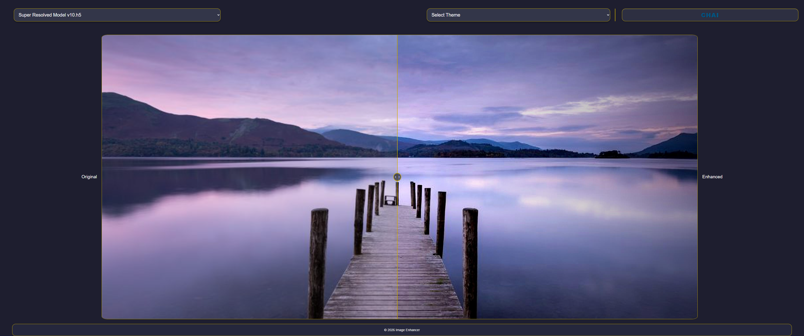
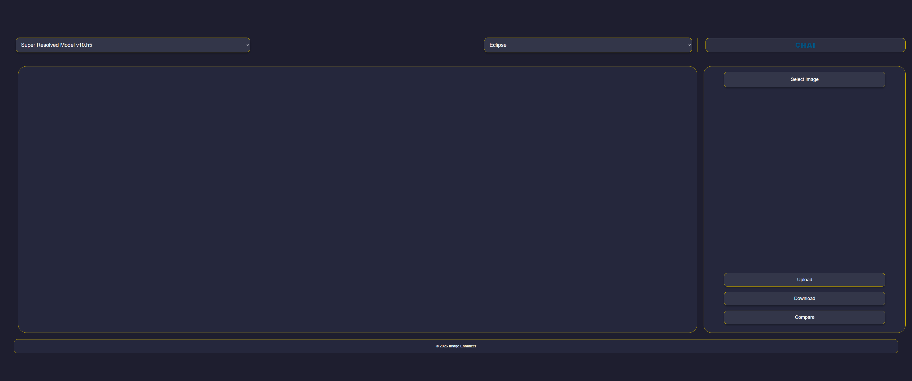
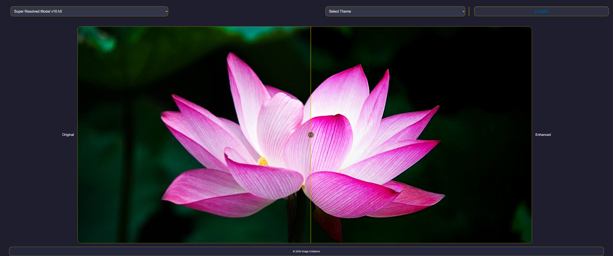
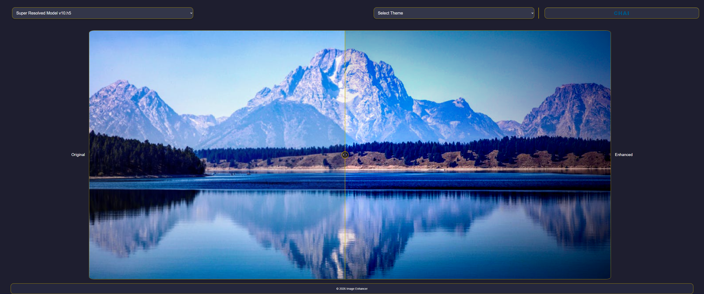
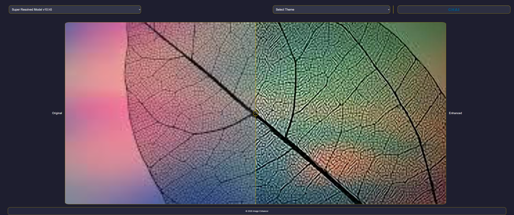

# 🚀 Super Image Quality Enhancer (SIQE)

<div align="center">
  
  <h3>Unleashing AI for Superior Image Quality</h3>
</div>

---

## 📽️ Project Demonstration

<div align="center">
  <video src="resources/UsageSample.mp4" width="100%" controls autoplay muted loop>
    Your browser does not support the video tag.
  </video>
</div>

---

## 🌟 Overview

**Super Image Quality Enhancer (SIQE)** is an advanced deep learning platform designed to breathe new life into low-resolution images. By leveraging **Residual Dense Blocks (RDBs)** and focusing on the **luminance (Y) component** of the YUV color space, SIQE achieves state-of-the-art upscaling while maintaining high computational efficiency.

Developed as a full-stack solution, SIQE provides a seamless journey from training custom models to deploying them in a modern, interactive web environment.

> [!NOTE]
> For a deep dive into the underlying research, read our paper: [Resolution Revolution: Unleashing AI for Superior Image Quality](resources/Resolution%20Revolution%20Unleashing%20AI%20for%20Superior%20Image%20Quality.pdf).

---

## 🎨 Key Features

### 💎 Intelligent Upscaling

Transform pixelated, low-quality images into crisp, high-definition visuals using our specialized AI models.

<div align="center">
  
</div>

### ⚖️ Real-time Comparison

Our interactive UI allows you to compare original and enhanced images side-by-side using an intuitive slider/toggle system.

<div align="center">
  
</div>

### 🛠️ Model Creator

Don't just use our models—create your own! Adjust hyperparameters, specify datasets, and train custom RDB architectures tailored to your specific needs.

### ⚡ GPU Accelerated

Optimized for performance with Docker containers that support GPU passthrough, ensuring rapid inference and training.

---

## 🛠️ Technology Stack

| Component | Technology |
| :--- | :--- |
| **Deep Learning** | TensorFlow, Keras, Residual Dense Blocks (RDB) |
| **Backend** | FastAPI (Python), OpenCV, NumPy, Pillow |
| **Frontend** | Next.js, React, TypeScript |
| **Infrastructure** | Docker, Docker Compose, PostgreSQL |

### Architecture Detail

The model utilizes **Residual Dense Blocks**, which allow for deeper networks without the vanishing gradient problem. By focusing on the **Y (Luminance) channel**, we capture the majority of structural details while significantly reducing the training power required compared to RGB-based models.

---

## 🚀 Quick Start

### Prerequisites

- Docker & Docker Compose
- NVIDIA Drivers (for GPU support)

### Installation

1.  Clone the repository:

    ```bash
    git clone https://github.com/AmerZuher/Super-Image-Quality-Enhancer.git
    cd Super-Image-Quality-Enhancer
    ```

2.  Start the services:

    ```bash
    docker compose up --build
    ```

3.  Access the application:

    - **Frontend**: `http://localhost:3000`
    -  **Backend API**: `http://localhost:8000/docs`

---

## 📸 Gallery

<div align="center">
  
  
  <br />
  
</div>

---

## 👥 Authors

- **Amer Zuher ALriahy** - [GitHub](https://github.com/AmerZuher)
- **Hisham Maher Sunjaq** - [GitHub](https://github.com/HishamSunjeq)

---

<div align="center">
  <p>Thank you for your interest in SIQE! 🚀</p>
  <p>If you find this project useful, please consider giving it a ⭐!</p>
</div>
