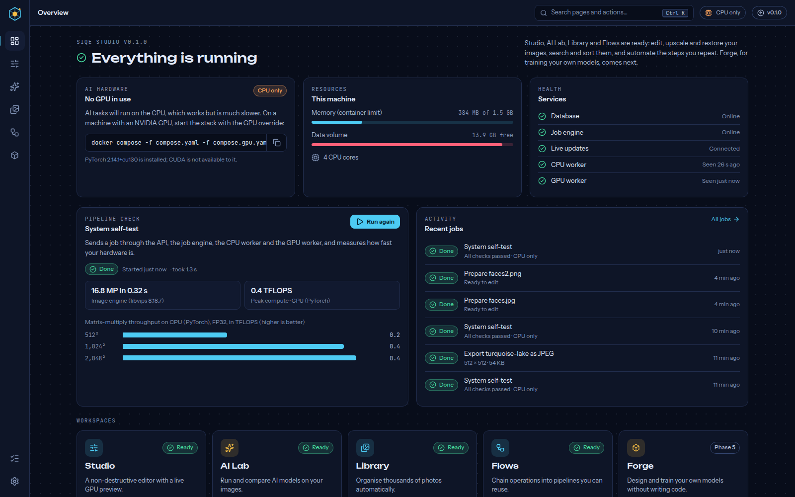
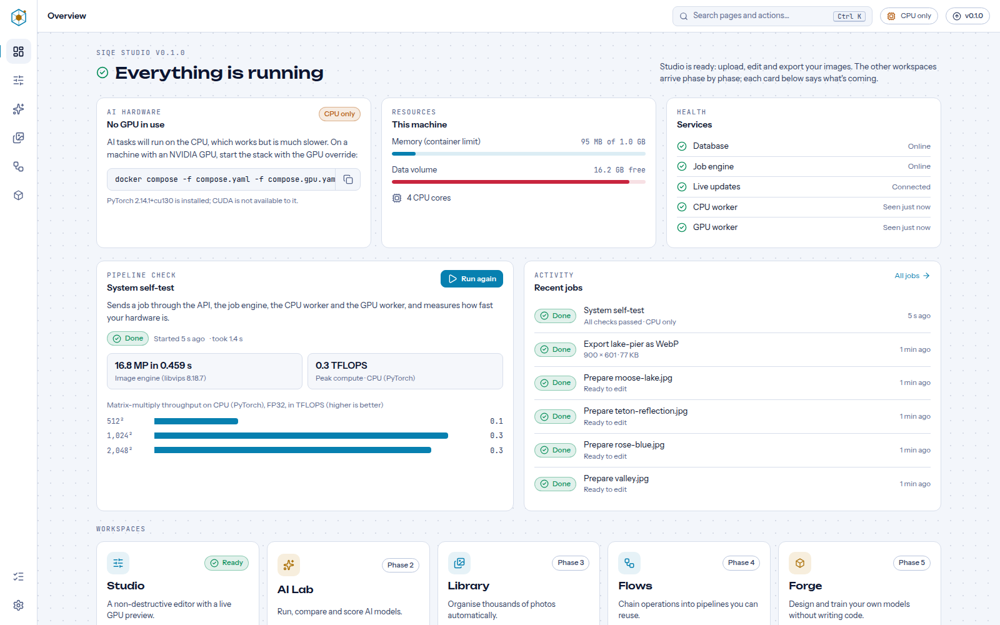
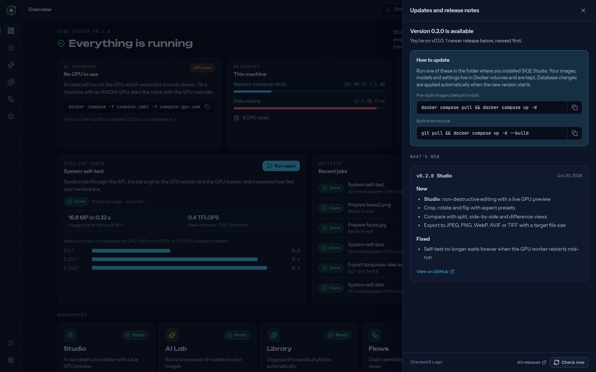
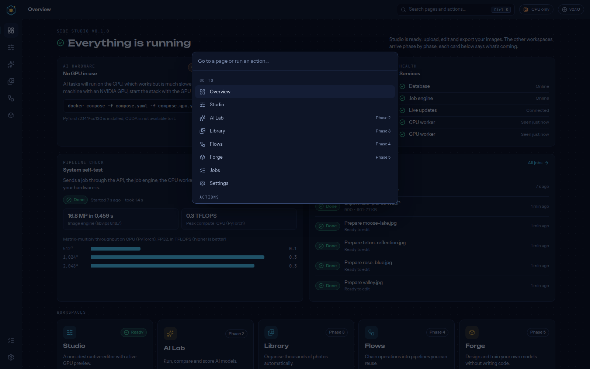
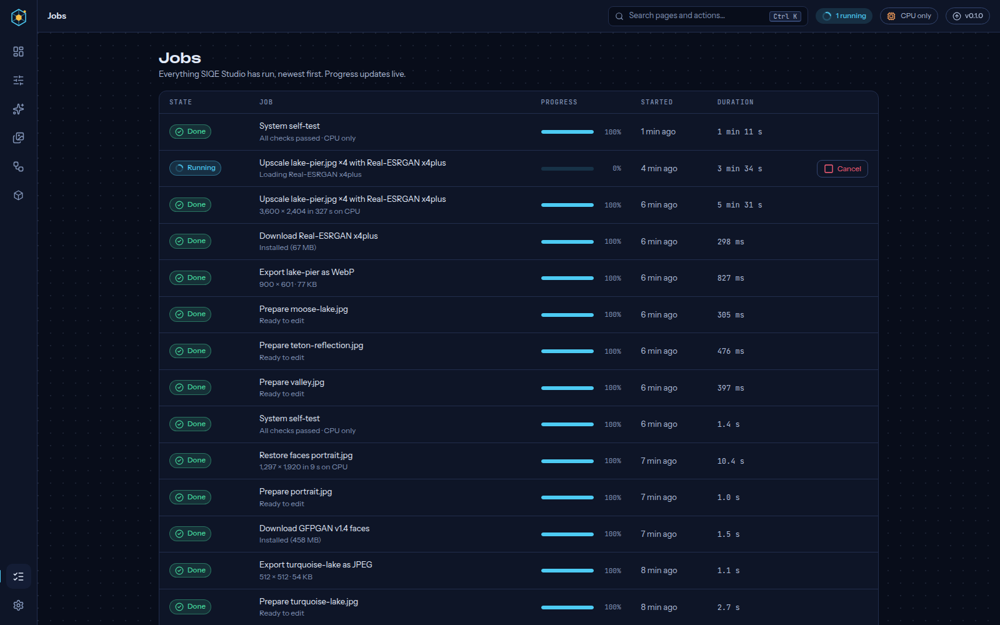
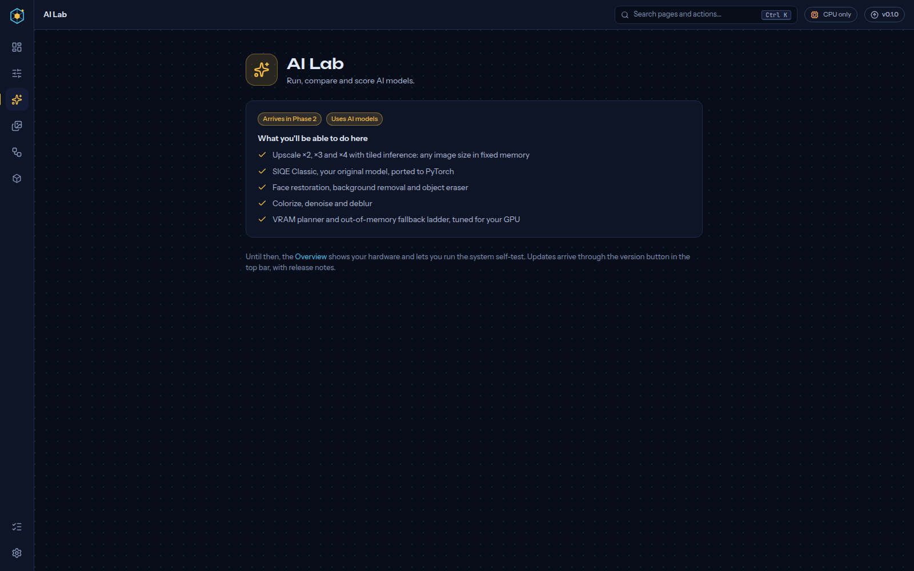
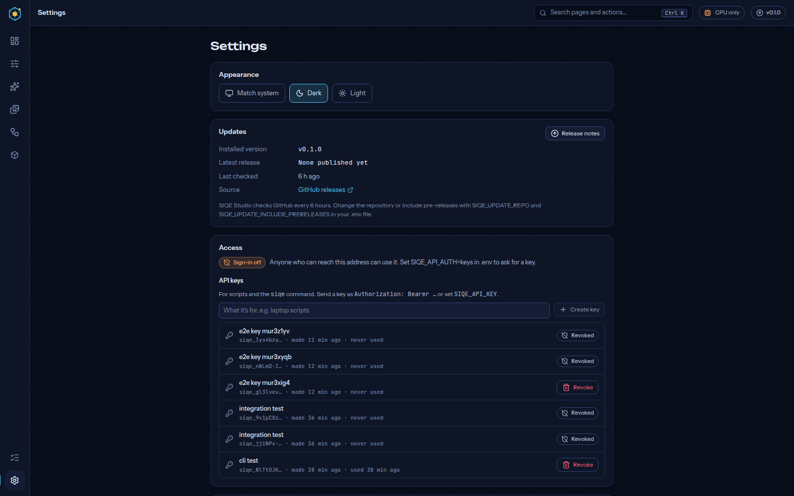
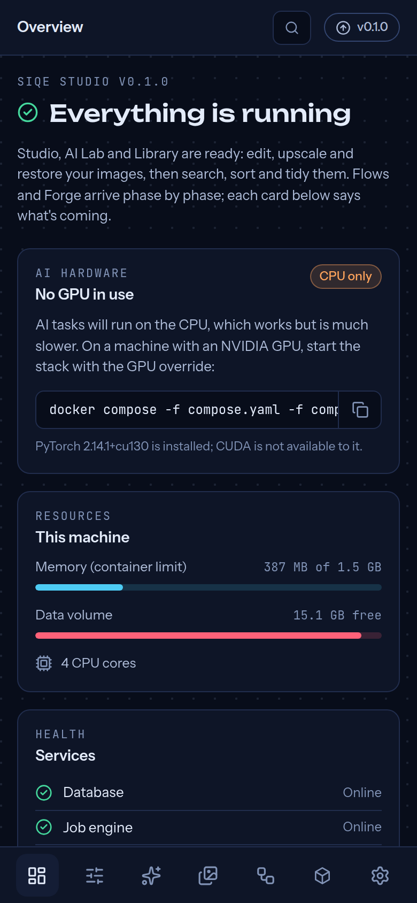
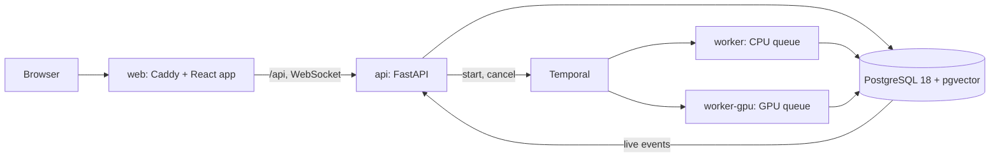

<div align="center">


# SIQE Studio

**Enhance, edit, organise and automate your images, and design and train the AI models that do it.**
Self-hosted. One command to run. Your GPU, your files, your models.

[](https://github.com/AmerZuher/Super-Image-Quality-Enhancer/actions/workflows/ci.yml)
[](LICENSE)




</div>

> [!NOTE]
> **Status: Phase 0 of 6 (foundation) is complete.** The platform runs end to end: job engine, workers, live updates, hardware monitoring, self-test and the Update Center. The five workspaces arrive phase by phase; see the [roadmap](#roadmap).

---

## Contents

[What it is](#what-it-is) · [Screenshots](#screenshots) · [Quick start](#quick-start) · [Updating](#updating) · [Hardware](#hardware) · [Configuration](#configuration) · [How it works](#how-it-works) · [Development](#development) · [Releasing](#releasing) · [Troubleshooting](#troubleshooting) · [Roadmap](#roadmap) · [Heritage and credits](#heritage-and-credits)

## What it is

SIQE Studio brings three earlier projects together into one platform: the **Super Image Quality Enhancer** research model, and the **Image-modifier** sorting and duplicate tools. It's organised into five workspaces:

| Workspace | What it does | Phase |
|---|---|---|
| **Studio** | Non-destructive editor with live GPU preview: curves, HSL, LUTs, compare views, smart export | 1 |
| **AI Lab** | Upscale ×2/×3/×4 at any size with tiled inference, restore faces, remove backgrounds, erase objects, colorize, denoise. Includes **SIQE Classic**, the original model | 2 |
| **Library** | Duplicates that keep the sharpest copy, similar-image and text search, smart albums, EXIF and GPS privacy tools | 3 |
| **Flows** | Visual pipelines for batches and hot folders, runnable from the API and CLI | 4 |
| **Forge** | Design neural networks by drawing them, train them with live charts, publish them to the AI Lab | 5 |

Built for real hardware limits: images are planned before processing, large ones are tiled and streamed, and running out of GPU memory steps down gracefully instead of crashing. See [docs/robustness.md](docs/robustness.md).

## Screenshots

| | |
|---|---|
|  |  |
| Overview, light theme | Update Center (example release notes) |
|  |  |
| Command palette (Ctrl K) | Jobs with live progress |
|  |  |
| AI Lab (arrives in Phase 2) | Settings |

<p align="center"></p>

All screenshots are regenerated with `make gallery`.

## Quick start

**You need:** Docker with Compose v2 (Docker Desktop on Windows or macOS, Docker Engine on Linux), about 12 GB of free disk for the images, and optionally an NVIDIA GPU.

```bash
git clone https://github.com/AmerZuher/Super-Image-Quality-Enhancer.git
cd Super-Image-Quality-Enhancer
make up          # CPU
make up-gpu      # or: with your NVIDIA GPU
```

Open **http://localhost:8080** and press **Run self-test** on the Overview. In about a second it confirms every service works and benchmarks your hardware.

<details>
<summary>Without <code>make</code> (for example on Windows)</summary>

```bash
cp .env.example .env            # then set POSTGRES_PASSWORD to something random
docker compose up -d --build
# with an NVIDIA GPU:
docker compose -f compose.yaml -f compose.gpu.yaml up -d --build
```
</details>

The first build downloads PyTorch with CUDA (the GPU worker image is about 9 GB). Once releases are published you can skip building with `make pull`.

Stop with `make down`. Your data stays in Docker volumes (`pgdata`, `data`) until you remove them.

## Updating

When a new version is released, the version button in the top bar changes to **"vX.Y.Z available"**. Click it to read the release notes and copy the update command:

```bash
docker compose pull && docker compose up -d      # pre-built images
git pull && docker compose up -d --build         # from source
```

Database changes are applied automatically when the new version starts. To stay on a version, set `SIQE_VERSION=0.1.0` in `.env`.

## Hardware

| Setup | What to expect |
|---|---|
| CPU only | Everything works. AI features (from Phase 2) are much slower. |
| NVIDIA, 8 GB VRAM | Full feature set. Large images are tiled automatically. |
| NVIDIA, 24 GB VRAM (for example RTX 3090) | The reference setup. Bigger tiles and batches, and room for training in Forge. |
| Apple Silicon | Runs on CPU; Docker can't pass the Apple GPU through. |

GPU support needs the NVIDIA driver and the [NVIDIA Container Toolkit](https://docs.nvidia.com/datacenter/cloud-native/container-toolkit/latest/install-guide.html). The Overview shows exactly what the GPU worker sees.

## Configuration

All settings live in `.env` (created by `make env` from [.env.example](.env.example), where each one is documented). The most useful:

| Variable | Default | Purpose |
|---|---|---|
| `SIQE_BIND` / `SIQE_PORT` | `127.0.0.1` / `8080` | Where the web app listens. Use `0.0.0.0` to open it to your network (there is no login). |
| `SIQE_VERSION` | `latest` | Image tag to run; pin a version to stay on it |
| `SIQE_MAX_INPUT_MEGAPIXELS` | `250` | Largest image accepted |
| `SIQE_GPU_VRAM_RESERVE_MB` | `1536` | VRAM always left free |
| `SIQE_GPU_WORKER_MEMORY` | `12g` | System RAM cap for the GPU worker |
| `SIQE_UPDATE_REPO` | this repository | Where the Update Center looks for releases |
| `SIQE_UPDATE_INCLUDE_PRERELEASES` | `false` | Also offer pre-releases |

## How it works


```mermaid
flowchart LR
  B[Browser] --> C[web: Caddy + React app]
  C -->|/api, WebSocket| A[api: FastAPI]
  A --> P[(PostgreSQL 18 + pgvector)]
  A -->|start, cancel| T[Temporal]
  T --> W1[worker: CPU queue]
  T --> W2[worker-gpu: GPU queue]
  W1 --> P
  W2 --> P
  P -->|live events| A
```

- **FastAPI** serves the REST API (documented at `/api/docs`) and a WebSocket of live events.
- **Temporal** runs every job durably: retries, heartbeats, cancellation, and resume after crashes.
- **Workers** do the work: the CPU worker runs workflows and image processing; the GPU worker runs one GPU task at a time so jobs never fight over VRAM.
- **PostgreSQL** is the only stateful service. It also delivers live events, so progress bars update the moment a worker commits.
- **Caddy** serves the React app with a strict Content Security Policy and proxies the API.

Full details: [docs/architecture.md](docs/architecture.md) · decisions: [docs/adr/](docs/adr/) · limits and error codes: [docs/robustness.md](docs/robustness.md) · Temporal UI: `make ops`, then http://localhost:8233.

## Development

```bash
make install        # backend (uv) and frontend (pnpm) dependencies
make dev-services   # PostgreSQL + Temporal in Docker, on localhost
make dev            # API, both workers and Vite with hot reload → http://localhost:5173
make check          # lint, type-check and unit tests (backend + frontend)
make test-integration e2e   # against a running stack
```

| Path | Contents |
|---|---|
| `backend/` | Python package `siqe`: API, Temporal workflows and activities, workers, CLI |
| `frontend/` | Vite + React + TypeScript app, Lattice design system, Playwright tests |
| `deploy/` | Caddy and Temporal configuration |
| `docs/` | Architecture, ADRs, robustness, brand, research, planning pages |
| `gallery/` | README screenshots |
| `samples/` | Demo and test images |

Read [AGENTS.md](AGENTS.md) before contributing; it has the golden rules (deterministic workflows, typed errors, generated API client) and the definition of done.

## Releasing

1. Add the user-facing changes to [CHANGELOG.md](CHANGELOG.md).
2. Create a GitHub release with a tag like `v0.2.0`, and paste the changelog section as its notes.
3. The **Release images** workflow publishes `ghcr.io/amerzuher/siqe-studio-{api,ai,web}` tagged `0.2.0`, `0.2` and `latest`.
4. Running installs show the update and your notes in the Update Center within 6 hours, or straight away with **Check now**.

The first time images are published, make the three packages public in GitHub (Profile → Packages → package settings → Change visibility) so installs can pull them without logging in.

## Troubleshooting

| Symptom | Fix |
|---|---|
| Overview says **No GPU in use** on a GPU machine | Start with `make up-gpu` and check the NVIDIA Container Toolkit: `docker run --rm --gpus all ubuntu nvidia-smi` |
| **GPU worker offline** | `docker compose logs worker-gpu`. Usually the toolkit is missing or `SIQE_GPU_WORKER_MEMORY` is below what your jobs need. |
| Error `temporal.unavailable` | `docker compose ps`; restart with `docker compose up -d temporal` |
| Port 8080 already in use | Set `SIQE_PORT` in `.env`, then `make up` |
| Update Center says it can't reach GitHub | Check internet access; set `SIQE_GITHUB_TOKEN` if you hit GitHub's rate limit |
| `toomanyrequests` while pulling images | Docker Hub's anonymous limit: `docker login`, or wait an hour |

Every API error has a stable code and a suggested fix; the full list is in [docs/robustness.md](docs/robustness.md#error-codes).

## Roadmap

| Phase | Delivers | Status |
|---|---|---|
| P0 Foundation | Job engine, workers, live updates, Overview, self-test, Update Center, Docker stack, CI | ✅ Done |
| P1 Studio | Storage, previews and deep zoom, classic edits, edit stack, WebGL preview, Compare, export | Next |
| P2 AI Lab | Model registry, tiled inference, VRAM planner, OOM ladder, SIQE Classic, upscalers, restoration | |
| P3 Library | Duplicates, similar and text search, smart albums, EXIF and GPS tools | |
| P4 Flows | Pipelines, batches, hot folders, API keys, CLI | |
| P5 Forge | Visual model builder, training with live charts, publish to AI Lab | |
| P6 Hardening | 8K+ robustness suite, performance, final docs | |

The interactive product plan, with UI mockups of every workspace, is in [docs/plan/blueprint.html](docs/plan/blueprint.html).

## Heritage and credits

SIQE Studio grows out of **Super Image Quality Enhancer**, a research project on super-resolution with Residual Dense Blocks working on the luminance (Y) channel. Read the paper, *Resolution Revolution: Unleashing AI for Superior Image Quality*, in [docs/research/](docs/research/resolution-revolution.pdf). The trained model returns as **SIQE Classic** in Phase 2.

**Authors:** Amer Zuher ALriahy and Hisham Maher Sunjaq.

Built with FastAPI, Temporal, PostgreSQL and pgvector, libvips, PyTorch, React, Vite, TanStack and Caddy. Third-party AI models added in later phases are limited to commercial-safe licenses, each listed with its license in the app.

The images in `samples/` were collected from the web for testing and have unknown licenses; replace them before any commercial use.

## License

[MIT](LICENSE) © 2026 Amer Zuher ALriahy, Hisham Maher Sunjaq
