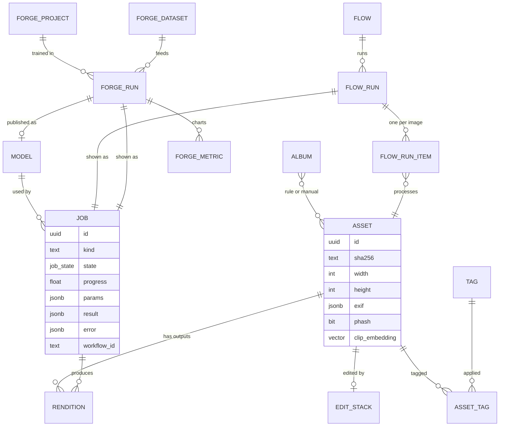
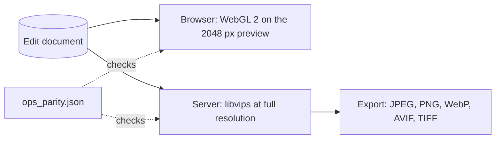
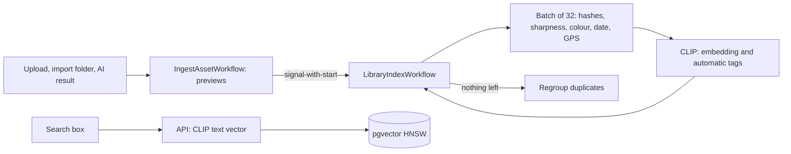
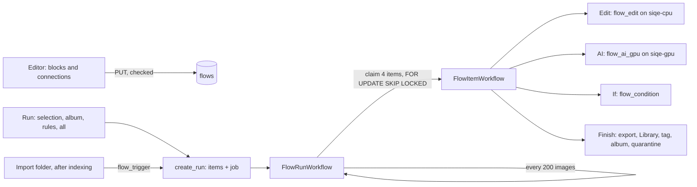
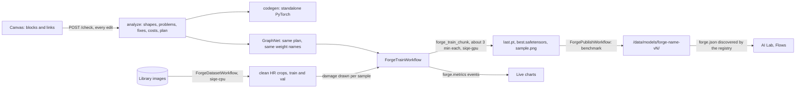
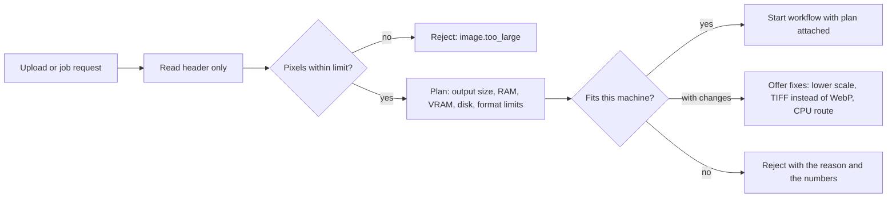
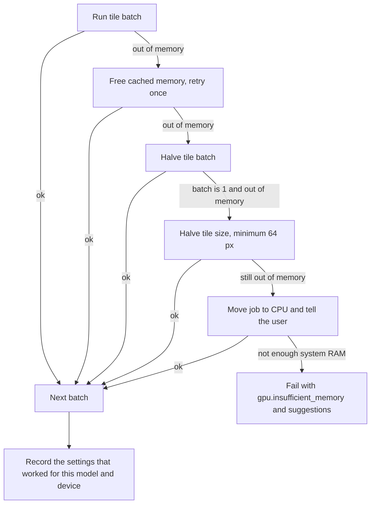
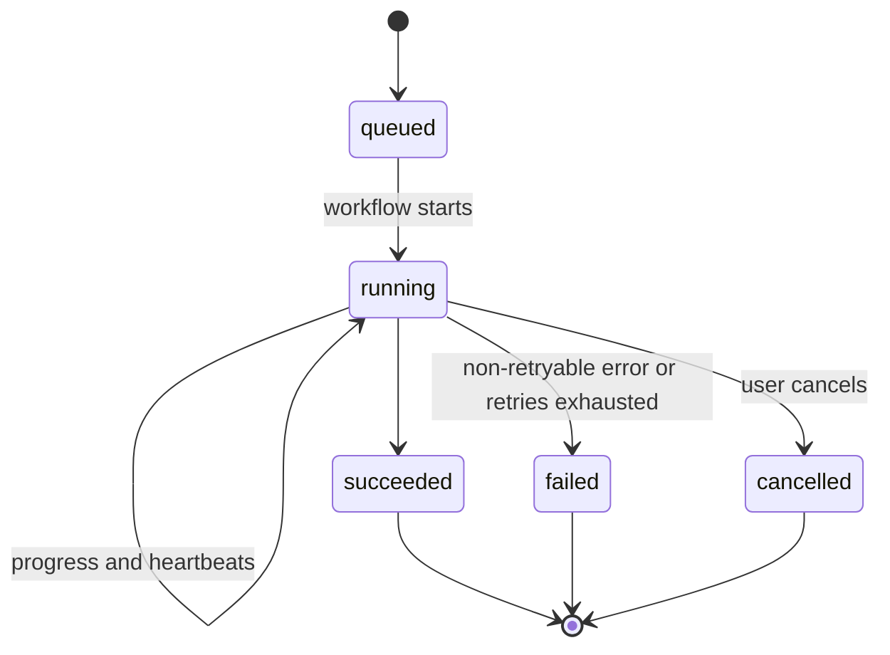
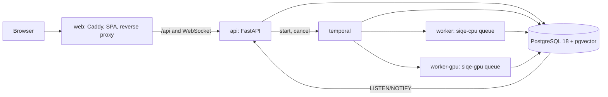

# SIQE Studio: architecture

| | |
|---|---|
| **Status** | Approved. Phases 0 (foundation), 1 (Studio), 2 (AI Lab), 3 (Library), 4 (Flows) and 5 (Forge) implemented. Living document, v3. |
| **Updated** | 2 October 2026 |
| **Product plan** | [docs/plan/blueprint.html](plan/blueprint.html): workspaces, UI mockups and the 83-operation catalog |
| **Decision records** | [docs/adr/](adr/) |
| **Limits and error codes** | [docs/robustness.md](robustness.md) |

SIQE Studio rebuilds Super-Image-Quality-Enhancer, Image-modifier and Image-Modifier- into one platform with five workspaces: Studio, AI Lab, Library, Flows and Forge. This document records the engineering decisions and keeps them in sync with the code. When a decision changes, update this file and add an ADR.

### What changed since v2 (your review)

| Topic | v2 proposal | Now | Why |
|---|---|---|---|
| Job orchestration | Celery on Valkey | **Temporal** | You asked; it fits durable, long, multi-step work better. See 3.3 and [ADR 0003](adr/0003-temporal.md). |
| Live events | Valkey pub/sub | **PostgreSQL LISTEN/NOTIFY** | With Celery gone, Valkey had no remaining job. One less service. |
| Name | Facetry (recommended) | **SIQE Studio** | Your choice. Your original model keeps the name "SIQE Classic". |
| Target GPU | 8 GB assumed | **RTX 3090, 24 GB** | Your hardware. Defaults are tuned for it; 8 GB cards remain supported. |
| Updates | Not planned | **Update Center** | You publish GitHub releases; the app shows newer versions with their notes (section 8). |
| TypeScript | 7.0 | **5.9** | TypeScript 7 lacks the compiler API that `openapi-typescript` needs. |

---

## 1. Decisions at a glance

| Area | Decision | Main reason |
|---|---|---|
| Backend | **Python 3.12 + FastAPI** | PyTorch forces Python for the AI side; FastAPI gives async I/O, Pydantic validation and the OpenAPI schema the frontend client is generated from. |
| Frontend | **Vite 8 + React 19 + TypeScript 5.9 (SPA)** | A local-first, canvas-heavy app gains nothing from server rendering. Caddy serves the static build. |
| Orchestration | **Temporal 1.32** (Python SDK 1.34) | Durable execution, retries, heartbeats, cancellation, long timers and signals out of the box. |
| Database | **PostgreSQL 18 + pgvector** | The only stateful service. Holds app data plus Temporal's two databases. |
| Live events | **LISTEN/NOTIFY → WebSocket** | Events are sent in the same transaction as the change they describe. |
| Image engine | **libvips 8.18 (pyvips) + OpenCV 5 + Pillow** | libvips streams images in small regions, so classic edits on 8K+ images use little memory. |
| AI runtime | **PyTorch 2.14 + spandrel + ONNX Runtime** | spandrel loads most super-resolution and restoration architectures; ONNX Runtime runs bring-your-own models. |
| Memory safety | **Resource governor** | Admission checks, VRAM planner, tiled streaming inference and an OOM fallback ladder (section 5). |
| Deployment | **Docker Compose**: 6 long-running services, 2 one-shot setup jobs, GPU override file | One command on any machine; NVIDIA GPU optional. |
| Updates | **GitHub releases → in-app Update Center** | Release notes reach users where they work. |

---

## 2. Tooling and environment

| Tool | Status | Notes |
|---|---|---|
| GitHub MCP | Connected | Pushes, PRs on request, CI results |
| Docker | Works in the build sandbox | Builds use the sandbox proxy and CA through build-time-only settings; nothing is baked into images |
| PyPI, npm, Docker Hub | Reachable | Docker Hub rate-limits anonymous pulls; the sandbox uses the `mirror.gcr.io` mirror |
| GitHub Container Registry downloads | Blocked in the sandbox | Only matters for pulling published images here; GitHub Actions publishes them normally |
| `huggingface.co`, `download.pytorch.org` | **Still blocked** in this session | Needed in Phase 2 for Hugging Face-hosted models. Allow both in the cloud environment's network settings, then start a new session |
| Context7 connector | **Not connected** | Connect at claude.ai → Customize → Connectors, then start a new session |
| frontend-design plugin | **Not installed** | Optional; install from the card offered in chat |

Dependency hygiene: pnpm 12 refuses packages published less than a day ago. We keep that protection on instead of adding exceptions, so pinned versions can trail the newest release by a day.

---

## 3. Stack

### 3.1 Backend: FastAPI

The AI work only exists in Python, so the backend is Python. FastAPI gives async handlers, Pydantic v2 validation, WebSockets and an OpenAPI schema. Django is synchronous-first and heavier than an API needs; Litestar is excellent but has a smaller community. See [ADR 0001](adr/0001-stack.md).

### 3.2 Frontend: Vite SPA

The app runs on your machine behind one gateway, has no SEO needs, and does its heavy lifting in the browser (WebGL preview, canvas, node editors). Vite builds static files; Caddy serves them and proxies `/api`. There's no Node server at runtime. A Tauri desktop build can wrap the same SPA later.

Libraries: TanStack Router and Query, Zustand, Tailwind CSS 4, cmdk (command palette), React Flow (Flows and Forge, from Phase 4), OpenSeadragon (deep zoom, Phase 1), react-markdown (release notes), Biome, Vitest, Playwright.

### 3.3 Orchestration: why Temporal over Celery

You asked about Temporal. I evaluated it against the plan's Celery design and switched.

| Need in SIQE Studio | Celery | Temporal |
|---|---|---|
| A 30-minute 8K upscale survives a worker crash and resumes at the last tile | Custom: acks_late, a job table, heartbeats, a reaper process, resume logic | Built in: activity heartbeats carry the last finished tile; a retry resumes from it |
| Flows: multi-step pipelines with branches over thousands of images | Chains and chords, fragile at scale | Workflows are ordinary async Python with child workflows; durable at every step |
| Forge: hours-long training with pause, resume and stop | Not a natural fit | Signals and queries on a running workflow |
| Cancel a running job cleanly | Revoke with terminate, which kills mid-write | Cooperative cancellation delivered at the next heartbeat |
| Scheduled work (hot folders, update checks, cleanup) | Celery beat, another process | Temporal Schedules |
| Seeing what happened | Logs | Full event history per job in the Temporal UI (`make ops`) |
| Extra services | Celery workers + Valkey | Temporal server (one container) + one-off schema job; Valkey removed |
| License | BSD | MIT |

The costs are real but manageable:
- Workflow code must be deterministic (no I/O, clocks or randomness). Activities do all I/O. `AGENTS.md` states this, and a unit test runs every workflow through Temporal's sandbox.
- Event history has limits (about 50,000 events). Large batches use child workflows in pages and `continue-as-new`.
- Temporal adds a server process. Measured idle: about 100 MB of RAM and 19 database connections with its pool capped at 10 per store. PostgreSQL's `max_connections` is raised to 200 for headroom.

Measured in Phase 0: a job runs API → Temporal → CPU worker → GPU worker in about one second end to end, and a job queued while the GPU worker was down finished on its own when the worker came back.

### 3.4 AI runtime

- **PyTorch** runs built-in models and Forge training. The `ai` image ships the CUDA build, which also runs on CPU.
- **spandrel** (MIT) recognises ESRGAN, SwinIR, SCUNet and GFPGAN checkpoints. We use only core spandrel; its "extra arches" package includes non-commercial licenses and stays out. We load state dicts ourselves with `torch.load(weights_only=True)` and hand them to spandrel, so no checkpoint can run code.
- **ONNX Runtime** (CPU) runs ISNet background removal, LaMa erase and NAFNet deblur on the CPU worker; `OnnxBackend` lets ONNX models use the same tiled pipeline as PyTorch ones ([ADR 0011](adr/0011-restore-models.md)).
- **Your own ONNX models** are uploaded in AI Lab, checked by a CPU job that runs them on test images (scale, size step, output range, speed) and installed as files under `models/user-*` with a descriptor, like Forge models. They always run on the CPU worker, tiled, in AI Lab and Flows ([ADR 0012](adr/0012-your-own-onnx-models.md)).
- **Erase and colorize** don't tile: the eraser fills each painted region with its surroundings at 512 × 512 and blends it back; the colorizer predicts colour at 256 × 256 and joins it with the photo's own lightness.
- **SIQE Classic**: your `v10.h5` (in git history at commit `588eb10`) is downloaded from that commit, converted with `h5py` to safetensors, and run by a PyTorch port of the network. TensorFlow isn't needed: a test checks the port against an independent numpy implementation of the Keras graph.
- **Face restoration**: our own RetinaFace implementation loads the facexlib detector weights; faces are aligned to the FFHQ template, restored with GFPGAN v1.4 and blended back (section 5.4).
- **Library search**: OpenCLIP ViT-B/32 runs in numpy (`siqe.ai.clip`) on the CPU worker and in the API, so searching never waits for the GPU worker. Its checkpoint is read without torch by a restricted unpickler (`siqe.ai.pth`) and stored as float16 safetensors (section 4.5, [ADR 0007](adr/0007-library-search-and-duplicates.md)).

The built-in catalog (`siqe.ai.manifest`) pins every file by URL, size and SHA-256 and allows only MIT, BSD-2-Clause, BSD-3-Clause and Apache-2.0 licenses. Sources are GitHub release assets, GitHub LFS files pinned to a commit (OpenCV Zoo), or the authors' own buckets; none needs Hugging Face. Details and trade-offs: [ADR 0006](adr/0006-ai-models-and-runs.md).

| Model | Task | License |
|---|---|---|
| Real-ESRGAN x4plus, x2plus, General v3 | Upscale ×4, ×2, ×4 (fast) | BSD-3-Clause |
| SwinIR-M ×4 (real-world) | Upscale ×4 | Apache-2.0 |
| SIQE Classic | Upscale ×3 (brightness) | MIT |
| SCUNet | Denoise | Apache-2.0 |
| ISNet | Background removal | Apache-2.0 |
| GFPGAN v1.4 + RetinaFace | Face restoration | Apache-2.0 + MIT |
| NAFNet (GoPro, int8 ONNX) | Deblur | MIT |
| LaMa (ONNX) | Erase objects | Apache-2.0 |
| SIGGRAPH17 colorizer | Colorize black and white photos | BSD-2-Clause |
| CLIP ViT-B/32 (OpenCLIP, LAION-400M) | Library search, similar images, automatic tags | MIT |

### 3.5 Versions in use

| Layer | Versions |
|---|---|
| Frontend | Vite 8.3, React 19.3, TypeScript 5.9, TanStack Router 1.170 and Query 5.104, Zustand 5, Tailwind CSS 4.3, cmdk 1.1, OpenSeadragon 6.1, Biome 2.5, Vitest 5, Playwright 1.63, pnpm 12.8, Node 24 |
| Backend | Python 3.12, FastAPI 0.142, Pydantic 2.13, SQLAlchemy 2.1 (asyncpg), Alembic 1.20, temporalio 1.34, structlog, Typer, uv, Ruff, mypy (strict), pytest |
| Imaging | pyvips 3.2 with libvips 8.18 (binary wheel), OpenCV 5, Pillow 12 |
| AI | PyTorch 2.14 (CUDA 13 build), nvidia-ml-py |
| Services | PostgreSQL 18 + pgvector, Temporal server 1.32, Temporal UI 2.54, Caddy 2 |

---

## 4. Data

### 4.1 Why PostgreSQL

| Criterion | PostgreSQL 18 | MongoDB | SQLite |
|---|---|---|---|
| Relational integrity (asset → rendition → job) | Strong | Manual | Strong |
| Flexible documents (edit stacks, flows, graphs) | JSONB with indexes | Native | Weaker indexing |
| Similarity search | pgvector HNSW, in the same query as filters | Separate setup | sqlite-vec, less mature |
| Several processes writing at once | Built for it | Fine | One writer at a time |
| Also hosts Temporal | Yes | No | No |
| License | PostgreSQL (permissive) | SSPL | Public domain |

PostgreSQL is the only stateful service. SQLite remains an option for a future single-binary "portable mode". See [ADR 0002](adr/0002-database.md).

### 4.2 Schema

Implemented: `jobs`, `worker_heartbeats`, `app_settings` and the `vector` extension (Phase 0); `assets` and `renditions` (Phase 1); `ai_models` and the `parent_id` and `derivation` of AI results on `assets` (Phase 2); the Library's analysis columns on `assets` (hashes, sharpness, colour, date taken, GPS, `vector(512)` embedding with an HNSW index, tags, duplicate group and rank, quarantine, source), `albums`, `album_assets` and `import_files` (Phase 3); `flows`, `flow_runs`, `flow_run_items`, `api_keys` and the `faces` count on `assets` (Phase 4); `forge_projects`, `forge_datasets`, `forge_runs` and `forge_metrics`, and `source` and `spec` on `ai_models` (Phase 5).



The `jobs` table is what the UI shows; Temporal's history is the execution record. Every job row maps to one workflow (`workflow_id = job-<uuid>`).

### 4.3 Files

Image bytes live on the `data` volume, never in the database:

```text
/data
├── media/originals/ab/cd/<sha256>.<ext>   immutable uploads, stored once per content hash
├── media/previews/<asset>/                320 px thumbnail, 2048 px preview, deep-zoom tile pyramid
├── media/renditions/<asset>/<id>.<ext>    exports are new files, written to a temp name and renamed
├── models/<model id>/<file>               downloaded weights, verified by sha256
├── checkpoints/<run>/                     Forge training checkpoints
└── tmp/                                   scratch space, cleaned on start and by age
```

### 4.4 Edit documents and the live preview

Studio never changes the original. Each asset carries an **edit document** (JSONB): geometry first (rotate clockwise, flip, crop in normalised coordinates of the rotated image), then adjustments in a fixed order: temperature, tint, exposure, whites, blacks, highlights, shadows, contrast, vibrance, saturation, black and white, sharpen, vignette.



The browser redraws on every slider move; the export workflow streams the same formulas through libvips. A shared fixture keeps them identical, and a Playwright test runs the actual shader on the GPU against it. Details and trade-offs: [ADR 0005](adr/0005-edit-documents-and-preview.md).

Import (`IngestAssetWorkflow`) makes a thumbnail, a 2048 px preview and a deep-zoom pyramid (510 px WebP tiles) used by the full-resolution inspector. Export (`ExportWorkflow`) checks format limits and free disk before it starts, can aim for a target file size by searching JPEG/WebP/AVIF quality, strips camera data and GPS by default (keeping the colour profile), and can be cancelled mid-encode.

### 4.5 Library



- **Indexing** runs in the background, one indexer at a time, in batches on the CPU worker. Everything is measured from the 2,048 px preview. Bumping `ANALYSIS_VERSION` re-analyses the library.
- **Search** turns the query into a CLIP vector in the API (the text half of the model, about 250 MB) and ranks by inner product with the mean tag phrase subtracted, which removes each image's bias towards matching any text. Tags and file names that match the query add a bonus. Without CLIP, the box searches names and tags.
- **Duplicates** are pairs with close perceptual hashes, or with CLIP similarity of at least 0.95 and loosely close hashes; groups are connected components, and the copy to keep is ranked by resolution, sharpness, format and age. Resolving a group moves the others to **quarantine**, which hides images everywhere until they are restored or deleted.
- **Smart albums** are rule sets (`siqe.library.rules`) compiled to SQL; the filter chips use the same rules.
- **Location** is removed in place without re-encoding (`siqe.imaging.metadata`); the clean file is a new image and the original goes to quarantine.
- **The import folder** is mounted read-only into the CPU worker and checked by a Temporal Schedule; files are imported once, after their size and time are stable.

Details and trade-offs: [ADR 0007](adr/0007-library-search-and-duplicates.md).

- **Faces** are counted after each indexing pass by RetinaFace (shipped with the face restoration model) on the GPU queue, on the preview, before watched flows start. Only the number is stored; uncounted images never match a `faces` rule.

### 4.6 Flows



- **A flow is a document**: blocks (`input`, conditions, edits, AI, finishes) and connections from a block's port (`out`, or `yes`/`no` for If) to the next block. `siqe.flows.document.check` normalises settings against the block catalog and lists problems per block (one Images block, a Finish block, no loops, nothing unreachable). The editor saves as you go; only a flow without problems can run or watch a folder.
- **A run** has one row per image. `FlowRunWorkflow` claims a few pending items at a time and runs a child `FlowItemWorkflow` for each; it starts afresh every 200 images. A failure stops only that image, and its error is kept on the item.
- **An image walks the graph in workflow code**; each block is one activity. Edits and AI write a lossless PNG for the next block; If decides a port with the same rules as smart albums (`siqe.library.rules.matches`), using the image's current size. AI blocks reuse the AI Lab pipeline (tiling, OOM ladder, calibration) on the GPU queue.
- **Finish blocks** are idempotent: each records its output against its step, so a retried activity never exports or saves twice. Exports go to `/output/<flow>/<date time>/`, and a run's files download as one zip.
- **Dry runs** take 10 images, export to a separate folder and only simulate Library changes.
- **Watching a folder**: after the indexer has analysed and grouped newly imported images, `flow_trigger` adds them to the flow's open watch run (or opens one) under a per-flow advisory lock; the run waits for more and finishes after a minute without any.
- **The same flow from anywhere**: the editor, `POST /api/flows/{id}/runs`, and `siqe run <flow or .flow.json> <files>`, which uploads the files first. With `SIQE_API_AUTH=keys`, every client needs an API key.

Details and trade-offs: [ADR 0008](adr/0008-flows-and-api-keys.md).

### 4.7 Forge



- **A model is a graph document** checked in plain Python (`siqe.forge.graph.analyze`): channels and scale per block, problems with one-click fixes, parameters, multiply-adds per pixel, a training-memory estimate, the patch multiple and the receptive field. The same analysis yields the plan that both `GraphNet` and the generated code are built from, so a checkpoint loads into either.
- **Datasets** are clean crops cut from Library images, with every Nth image held out for validation. The degradation chain (blur, bicubic down, noise, JPEG) is applied to each sample as it is drawn, so its settings can change without a rebuild and one dataset serves every scale.
- **Training** runs in chunks of about three minutes on the GPU queue, each resuming exactly from the last checkpoint, so other GPU work waits minutes at most. Pause, resume and stop are workflow signals; a cancelled chunk saves before it ends. Charts get a training point every 25 steps and a validation point (PSNR and SSIM on brightness, against bicubic) at the interval you choose.
- **Publishing** scores the best checkpoint on the held-out crops and copies it, with a `forge.json` descriptor, to the models folder. The registry merges these into the catalog, and AI Lab and Flows run them through the usual tiled pipeline.
- **ONNX export** (`siqe.forge.onnx_export`, on the AI worker) rebuilds the best checkpoint as `GraphNet`, exports it with `torch.export` (TorchScript as a fallback) with a dynamic batch and sizes in steps of the patch multiple, and keeps the file only if ONNX Runtime matches PyTorch within 0.001. The file can be added back as your own ONNX model ([ADR 0013](adr/0013-forge-onnx-export.md)).

Details and trade-offs: [ADR 0009](adr/0009-forge.md).

### 4.8 Model packages (planned, Phase 7)

Generation models (a 7B to 20B transformer, an 8B text encoder and a VAE, 15 to 60 GB) arrive as **packages**: catalog entries of pinned components with precision variants, installed by `PackageInstallWorkflow` (preflight checks for disk, GPU memory and licence, resumable verified downloads, a smoke test) and run by `GenerateWorkflow` on the GPU queue, one component in memory at a time. Packages with a personal-use licence, such as Qwen-Image-2.1, install only after you accept the licence and are labelled wherever they are used. Plan, prerequisites and steps: [plan/phase7-model-packages.md](plan/phase7-model-packages.md); decision: [ADR 0010](adr/0010-model-packages.md) (proposed).

---

## 5. Robustness and resource safety

The rules and current limits are listed in [docs/robustness.md](robustness.md). The design:

### 5.1 Principles

1. **Plan before you run.** Every job gets a resource plan (output size, RAM, VRAM, disk, format limits) before it's queued.
2. **Stream, don't load.** Large images flow through libvips regions and tiled inference.
3. **Degrade, don't die.** Out of memory → smaller batch → smaller tile → CPU, each step recorded on the job.
4. **Workers are disposable.** Activities are idempotent and checkpointed; Temporal retries them.
5. **Every failure has a code.** Typed errors, RFC 9457 problem+json, a `fix` hint the UI shows as-is.

### 5.2 Admission control



Dimensions are read from the header without decoding, against `SIQE_MAX_INPUT_MEGAPIXELS` (default 250). Pillow's `MAX_IMAGE_PIXELS` is set to the same value as a second guard. Format ceilings are known to the planner: WebP stops at 16,383 px per side and JPEG at 65,535 px. A job needs twice its predicted output size in free disk. Uploads stream to disk in one request and are hashed on the way (never held in memory); the same file uploaded twice is recognised by its SHA-256. Resumable uploads may follow if very large files need them.

### 5.3 Worked example: 8K image, ×4 upscale

| Quantity | Value |
|---|---|
| Input | 7680 × 4320 = 33.2 MP |
| Output | 30720 × 17280 = 530.8 MP; 1.59 GB as 8-bit RGB, 6.37 GB as float32, so it never sits in RAM |
| Tiling | 448 px core + 32 px context per side = 512 px tiles; 18 × 10 = 180 tiles on an 8 GB card |
| On your RTX 3090 | The VRAM planner measures each model and typically picks larger tiles and batches several per forward pass; fewer tiles, same memory safety |
| Host memory per tile | Around 50 MB; tile centres are written straight into a disk-backed array and encoded in strips |
| Format check | WebP refused (16,383 px limit); PNG, TIFF or JPEG offered |
| Browser | Never loads the full image: a preview plus a deep-zoom pyramid |

### 5.4 Tiled inference

Tiles are processed with surrounding context (16 to 32 px per side, per model) and only their core is kept, so there are no seams and no full-size blending buffer; a test shows a tiled run equals a whole-image run with real Real-ESRGAN weights. Every input is reflect-padded to the same square size, rounded up to the multiple the model needs, so tiles batch into one forward pass. The result is written into a memory-mapped array in `tmp/` and encoded to PNG by libvips, so a 500-megapixel result never sits in RAM.

The first run of a model on a GPU measures peak memory at two tile sizes and fits a line, stored per model and GPU in `ai_models.calibration`; later runs pick the largest tile, then the largest batch, that leaves `SIQE_GPU_VRAM_RESERVE_MB` free. The finished tiles ride along in Temporal heartbeats; with the on-disk result, a retried activity continues where it stopped.

Face restoration runs after the upscale: faces are detected on a copy at most 1,280 px wide, each is warped to a 512 px aligned crop with a least-squares similarity transform, restored, and blended back with a feathered mask. Only the region around each face is read.

### 5.5 OOM fallback ladder



Implemented in `siqe.ai.tiling.run_tiled`. Halving the tile splits the tiles still to do; finished ones are kept. Unit tests walk the whole ladder with a fake GPU and check the result still equals a whole-image run. The settings that worked are stored on the model, and any step taken is shown on the job.

### 5.6 GPU arbitration

- The GPU worker polls the `siqe-gpu` Temporal task queue with **one activity at a time**. Parallelism comes from batching tiles inside an activity, never from two jobs sharing VRAM.
- Interactive jobs (the image you're looking at) and batch jobs will use separate task queues, with interactive work picked first (Phase 4, when batches arrive).
- Forge training runs as chunked activities of about three minutes on the same worker. Each chunk ends with a checkpoint, and GPU work queued meanwhile runs before the next chunk, so a training run never blocks an enhancement for hours.
- One model stays loaded between runs (plus the face models when used); loading another releases it.

### 5.7 System memory and disk

Workers read the container's real memory limit from cgroups, not the host total (implemented in `siqe.system.resources`). Every container has a Compose memory limit, so a runaway process is stopped by Docker instead of freezing your PC. `MALLOC_ARENA_MAX=2` reduces fragmentation. Below 5% free disk, new jobs pause.

### 5.8 Job reliability



- The job row is committed before its workflow starts, so the first activity always finds it.
- Activities retry with backoff. Heartbeat timeouts detect stuck or dead workers and reschedule the activity.
- Final states are never overwritten, so a late progress update can't revive a cancelled job.
- Progress writes are throttled to at most four per second per job, and each is also a Temporal heartbeat.

### 5.9 Training safety (Forge)

A run starts only when the graph has no problems, the dataset is built, and the patch size fits the model (a multiple of its Down blocks) and the dataset's crops. Out of memory halves the batch and doubles gradient accumulation, keeping the effective batch. bfloat16 autocast is used where the GPU supports it (the RTX 3090 does). Each chunk ends with a checkpoint and the next resumes exactly, including random states. A non-finite loss skips the step and halves the learning rate; twenty in a row stop the run as diverged. Notes on the run say what was adjusted and when.

### 5.10 Input edge cases

EXIF rotation, CMYK and wide-gamut profiles, 16-bit, alpha, palette and 1-bit images, animated GIF/WebP/APNG, HEIC/AVIF, truncated files, images smaller than a tile, extreme aspect ratios, Y-channel models on RGB input, NaN outputs, duplicate uploads and half-copied hot-folder files are each handled explicitly. The full table is in [docs/robustness.md](robustness.md).

### 5.12 Measured performance (Phase 6)

Measured on the CI-class sandbox (4 CPU cores, no GPU) with `tests/integration/test_robustness.py` and a probe script; your PC will be faster.

| Work | Time |
|---|---|
| Prepare an 8K photo (thumbnail, preview, deep-zoom pyramid) | 3 to 9 s |
| Prepare a 96 MP and a 240 MP photo | about 9 s and 30 s, in bounded memory |
| Export 8K: JPEG, PNG, WebP, TIFF | 3.6 s, 6.6 s, 9.4 s, 14 s |
| Export 8K AVIF | 18.5 s (was 52 s before effort 3 for big images) |
| Library analysis of a new 8K photo | within 30 s of it becoming ready |
| API: library page, assets, jobs, system | 9 to 14 ms median |
| Library search by description | about 0.1 s for a new query, 15 ms repeated |
| First load of the web app | 123 kB of script (gzipped) before a workspace opens; each workspace loads its own chunk |

### 5.11 Observability

- structlog JSON logs carrying `job_id`.
- `/api/health/live` and `/api/health/ready`, plus Docker health checks.
- A worker heartbeat every 10 seconds with CPU, RAM, disk and GPU readings, shown live on the Overview.
- The Temporal UI (`make ops`, port 8233) for each job's full history.

---

## 6. Naming

**SIQE Studio**, your choice. I proposed Facetry; it remains unused on PyPI and npm if you ever want it. The original model is **SIQE Classic**, and the design language is **Lattice**.

---

## 7. Structure

### 7.1 Containers



| Service | Image | Role |
|---|---|---|
| `db` | `pgvector/pgvector:pg18` | App data, Temporal's databases, event bus |
| `temporal-schema` | `temporalio/admin-tools:1.32.0` | One-shot: creates and migrates Temporal's schema |
| `temporal` | `temporalio/server:1.32.0` | Orchestration |
| `temporal-ui` | `temporalio/ui:2.54.1` | Optional (`make ops`), port 8233 |
| `init` | `siqe-studio-api` | One-shot: Alembic migrations and Temporal namespace |
| `api` | `siqe-studio-api` (537 MB) | REST, WebSocket events, OpenAPI, Library text search, optional API-key sign-in; mounts the output folder for downloads |
| `worker` | `siqe-studio-api` | All workflows plus CPU activities, Library indexing, flow blocks; mounts the import folder read-only and the output folder |
| `worker-gpu` | `siqe-studio-ai` (9.3 GB, CUDA PyTorch) | GPU activities one at a time: AI runs, AI flow blocks, face counting, Forge training chunks and benchmarks |
| `web` | `siqe-studio-web` (94 MB) | Caddy with the built SPA, port 8080 on 127.0.0.1 |

### 7.2 Repository

```text
.
├── AGENTS.md                guidelines for AI agents working in this repo
├── README.md · CHANGELOG.md · LICENSE · .env.example · Makefile
├── compose.yaml             all services
├── compose.gpu.yaml         NVIDIA device reservation for worker-gpu
├── compose.dev.yaml         publishes db and temporal on localhost for `make dev`
├── .github/                 CI, release images to GHCR, Dependabot, PR template
├── backend/                 Python package `siqe` (uv project)
│   ├── Dockerfile           targets: api, ai
│   ├── src/siqe/
│   │   ├── api/             FastAPI app, routes, schemas, dependencies
│   │   ├── core/            settings, logging, typed errors
│   │   ├── db/              models, session, Alembic migrations
│   │   ├── events/          LISTEN/NOTIFY publisher and WebSocket hub
│   │   ├── orchestration/   Temporal connection and namespace setup
│   │   ├── workflows/       deterministic workflow definitions
│   │   ├── activities/      everything that touches the outside world
│   │   ├── jobs/            job records and throttled progress reporting
│   │   ├── workers/         worker processes and heartbeats
│   │   ├── ai/              model catalog, downloads, tiling, memory governor, CLIP in numpy
│   │   ├── library/         analysis, duplicates, rules, search, import folder, face counts
│   │   ├── flows/           block catalog, flow documents, recipes, edit operations, run records
│   │   ├── forge/           block catalog, graph checks, code generation, templates, datasets, training
│   │   ├── auth/            API keys and the optional sign-in middleware
│   │   ├── system/          container-aware CPU, memory and disk readings
│   │   ├── updates/         GitHub release checks for the Update Center
│   │   └── cli/             the `siqe` command (server tasks, and flows/upload/run over HTTP)
│   └── tests/               unit/ and integration/
├── frontend/                Vite SPA
│   ├── Dockerfile           build, then Caddy
│   ├── src/app/             router, shell (rail, top bar, palette, Update Center)
│   ├── src/features/        overview, jobs, settings, workspace pages
│   ├── src/components/ui/   Lattice primitives
│   ├── src/lib/             API client (generated types), events, stores, formatting
│   └── e2e/                 Playwright tests and gallery capture
├── deploy/                  Caddyfile, Temporal dynamic config and schema script
├── import/                  the Library's import folder (created by `make env`, not in git)
├── output/                  where flows export files (created by `make env`, not in git)
├── docs/                    architecture, ADRs, robustness, brand, research, plan pages
├── gallery/                 README screenshots (`make gallery`)
├── samples/                 demo and test images
└── scripts/dev.sh           local hot-reload runner
```

---

## 8. Update Center

You publish releases on GitHub; the app tells users and shows what changed.

1. **Publish:** create a GitHub release tagged `vX.Y.Z` with user-facing notes. The `Release images` workflow builds the `api`, `ai` and `web` images and pushes them to `ghcr.io/amerzuher/siqe-studio-*` as `X.Y.Z`, `X.Y` and `latest`. Pre-releases don't move `latest`.
2. **Detect:** the API reads the repository's releases from the GitHub API at most every 6 hours, using ETags, and caches them in `app_settings`. Offline, it shows the last known list and says so.
3. **Show:** the version button in the top bar turns into "vX.Y.Z available". It opens a drawer with every newer release's notes, rendered from Markdown with raw HTML disabled, and the exact update commands.
4. **Update:** `docker compose pull && docker compose up -d` (or `git pull && docker compose up -d --build` from source). The `init` job applies database migrations on start.

A one-click updater would need the Docker socket inside a container, which is root-equivalent access to your machine. It's deliberately left out. If you want it later, it can be an opt-in sidecar.

Settings: `SIQE_UPDATE_REPO`, `SIQE_UPDATE_INCLUDE_PRERELEASES`, optional `SIQE_GITHUB_TOKEN`.

---

## 9. Security (single user)

- Binds to `127.0.0.1:8080` by default. Exposing it is a deliberate `.env` change.
- Caddy sets a strict Content Security Policy on the app: no inline scripts, no third-party origins.
- Database and Temporal ports are not published (except in `compose.dev.yaml`, on localhost).
- Containers run as a non-root user with memory limits.
- Release notes render without raw HTML.
- Uploads are identified by reading the file header, never by extension or client type, and stored under hash-based paths; user file names never become paths. Deep-zoom paths are resolved inside the image's folder only.
- Exports strip camera data and GPS location by default. The Library can remove location from originals without re-encoding.
- The import folder is mounted read-only; SIQE Studio copies files in and never changes the originals.
- Optional sign-in (`SIQE_API_AUTH=keys`): API keys are 256-bit, stored only as SHA-256 hashes and shown once. Scripts send them as a bearer token; the web app keeps one in an HttpOnly, SameSite=Strict cookie. The check is plain ASGI, so it covers the events WebSocket too. Keys are revocable in Settings or with `siqe keys revoke`.
- Model checkpoints load with `weights_only=True` or the restricted unpickler; flow exports can't leave their run's folder, and run downloads serve only files the run exported.
- CI runs a Trivy scan of the API image. Dependabot watches uv, npm, Docker and Actions. pnpm's minimum-release-age check stays on.

---

## 10. Execution plan

| Phase | Delivers | Status |
|---|---|---|
| **P0 Foundation** | Repo restructure, backend and frontend skeletons, Temporal pipeline, live events, Overview with hardware and self-test, Update Center, Compose stack, CI and release workflows, AGENTS.md, README, gallery | **Done** |
| **P1 Studio and storage** | Content-addressed storage, admission checks, previews and deep zoom, classic operations, edit stack, WebGL preview, Compare viewer, export with format checks | **Done** |
| **P2 AI Lab and governor** | Model registry and downloads, tiling engine, VRAM calibration, full OOM ladder, SIQE Classic port, upscalers, faces, cutout, denoise, full-resolution compare | **Done** (erase, colorize, deblur and bring-your-own ONNX moved to P6: their weights are on Hugging Face, which this build environment can't reach) |
| **P3 Library** | Import folder, hashing and embeddings, duplicates with quarantine, similar and text search, automatic tags, smart and hand-picked albums, camera details and location removal | **Done** (face-based albums need face detection on the GPU queue; they move to P4) |
| **P4 Flows** | Node editor, batch runs with paged child workflows, dry runs, recipes, folder watching, API keys and optional sign-in, `siqe` CLI commands, face counts and face rules | **Done** |
| **P5 Forge** | Visual builder, shape checker with fixes, graph-to-PyTorch compiler, dataset builder with a damage preview, chunked and resumable training, live charts, publish to AI Lab | **Done** (ONNX export moves to P6, with bring-your-own ONNX) |
| P6 Hardening | 8K+ robustness suite, performance pass, erase, colorize, deblur, bring-your-own ONNX and ONNX export, final docs and gallery, `docker compose up` verified on your PC | In progress (robustness suite, performance pass, erase, colorize, deblur, your own ONNX models and ONNX export done) |
| P7 Model packages | Installable multi-file model packages with a preflight-checked install workflow; text to image and image to image with Qwen-Image (Apache-2.0) by default and Qwen-Image-2.1 as an opt-in personal-use package; AI Lab Create tab, an Edit with a prompt flow block, `/api/generate` and `siqe generate` | Planned: [plan](plan/phase7-model-packages.md), [ADR 0010](adr/0010-model-packages.md) (proposed) |

Each phase ends with commits pushed to `claude/brave-keller-fgjtdn`, refreshed screenshots in `gallery/`, an updated README and a CHANGELOG entry.
