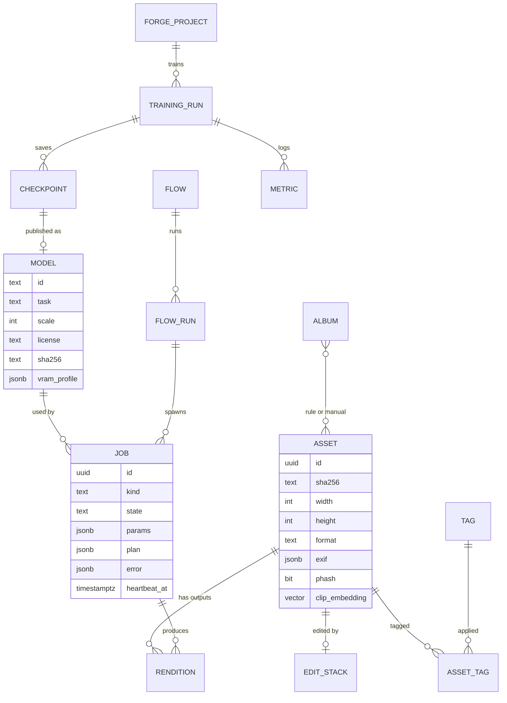
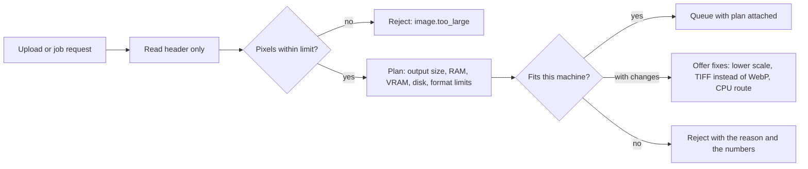
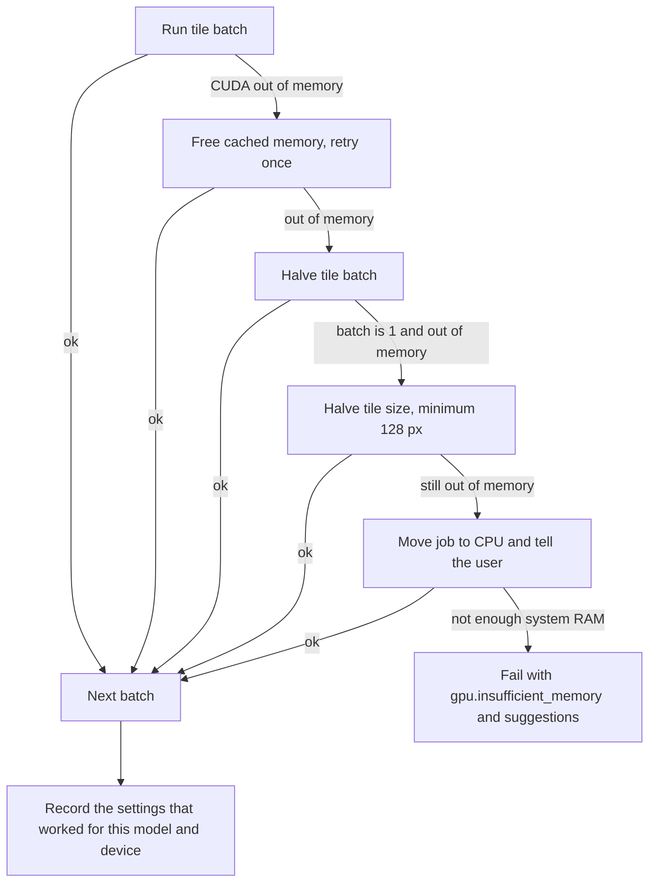
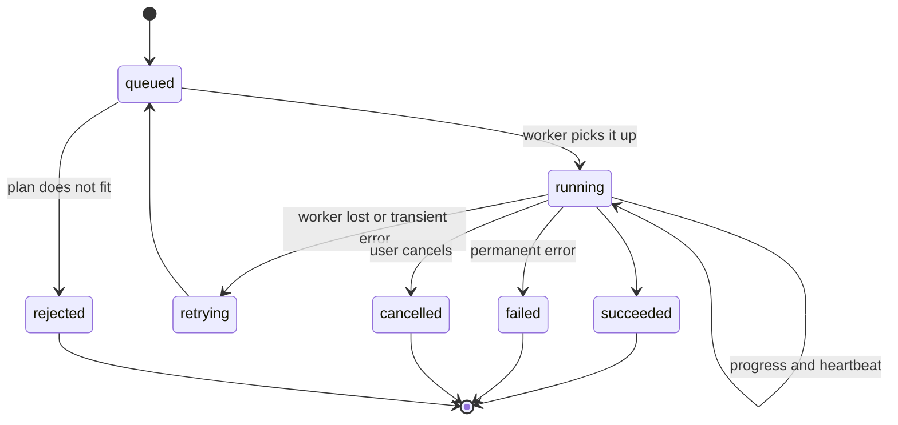
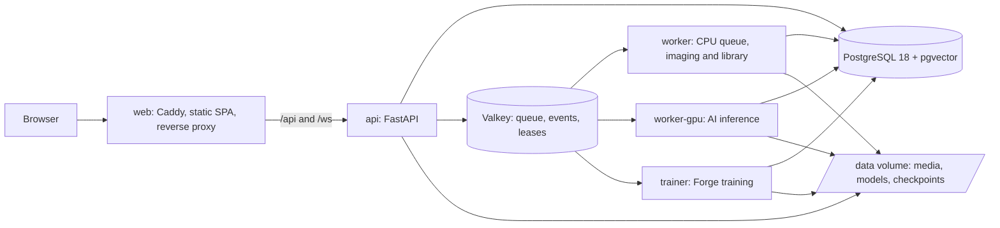

# Facetry: architecture proposal

| | |
|---|---|
| **Status** | Proposed, awaiting review (v2) |
| **Date** | 1 October 2026 |
| **Replaces** | Plan v1 ([docs/plan/blueprint.html](plan/blueprint.html)) where the two differ |
| **Working name** | Facetry (see [Naming](#6-naming)); the old name SIQE stays on your original model, "SIQE Classic" |

This document is the technical plan for rebuilding Super-Image-Quality-Enhancer, Image-modifier and Image-Modifier- into one platform. Plan v1 described the product: five workspaces (Studio, AI Lab, Library, Flows, Forge) and 83 operations. This version makes the engineering decisions: stack, database, memory safety, naming, repository layout, agent guidelines and the build order. Nothing here is built yet. Once you approve it, this file becomes the living architecture reference and stays in sync with the code.

---

## 1. Decisions at a glance

| Area | Decision | Main reason |
|---|---|---|
| Backend | **Python 3.12 + FastAPI** | PyTorch forces Python for the AI side; FastAPI gives async I/O, Pydantic validation and an OpenAPI schema we generate the frontend client from. |
| Frontend | **Vite 8 + React 19 + TypeScript (SPA)** | Your suggestion is the right call. A local-first, canvas-heavy app gains nothing from server rendering. Plan v1's Next.js is dropped. |
| Job queue | **Celery 5.6 on Valkey** | Mature routing, priorities, retries and revocation; one queue per resource class (CPU, GPU, training). |
| Database | **PostgreSQL 18 + pgvector** as the only system of record | Relational integrity, JSONB for flexible documents and vector search for "find similar" in one engine. |
| Ephemeral state | **Valkey 9** (BSD-licensed Redis fork) | Queue broker, live progress events, GPU leases, caches. Nothing in Valkey is needed after a restart. |
| Image engine | **libvips (pyvips) + OpenCV + Pillow** | libvips streams images in small regions, so classic edits on 8K+ images use little memory. |
| AI runtime | **PyTorch 2.14 + spandrel + ONNX Runtime** | spandrel loads most super-resolution and restoration architectures from weight files; ONNX Runtime runs user-supplied models. |
| Memory safety | **Resource governor**: admission checks, VRAM planner, tiled streaming inference, OOM fallback ladder | Every job is sized before it starts and degrades step by step instead of crashing. |
| Deployment | **Docker Compose, 7 containers**, GPU via an override file | One command on any machine; NVIDIA GPU optional. |
| Name | **Facetry** (recommended) | See section 6. |

---

## 2. Tooling check: MCP servers, skills and plugins

Everything needed to build, test and screenshot the project is available in this cloud session. Two manual actions would improve coverage. Neither blocks the start.

### What I use as-is

| Tool | Used for | Status |
|---|---|---|
| GitHub MCP | Pushes, PRs if you want them, reading CI results | Connected, scoped to this repository |
| Docker | Building and running every image | Works after I configure the daemon with this sandbox's proxy. Pulls from Docker Hub succeed. |
| PyPI and npm | All Python and JavaScript dependencies | Reachable |
| Chromium + Playwright | End-to-end tests and capturing `gallery/` screenshots | Pre-installed |
| Built-in skills | `run` (launch the app), `code-review`, `security-review`, `simplify`, `session-start-hook` (auto-install dependencies in future cloud sessions), `dataviz` (training charts) | Available |

I checked the container constraints that shaped the Dockerfiles. Debian's package mirror is blocked here, so the images install nothing with `apt`. libvips 8.18, OpenCV 5 and HEIF support all come from PyPI wheels (`pyvips[binary]`, `opencv-python-headless`, `pillow-heif`), which I verified inside a `python:3.12-slim` container. That also makes the images smaller and reproducible on your PC.

### Manual actions for you

| # | Action | Why | Required? |
|---|---|---|---|
| 1 | Allow `huggingface.co` and `download.pytorch.org` in the cloud environment's network settings | Still refused in this session (checked at 11:05 UTC). Needed to test Hugging Face-hosted models here (BiRefNet, Depth Anything V2, DDColor, CLIP) and for small CPU-only PyTorch images. If you already changed it, the setting may only apply to new sessions. | Recommended. Without it I test with GitHub-hosted models and you verify the rest on your PC. |
| 2 | Connect the **Context7** connector on claude.ai | It serves current documentation for libraries newer than my training data (Vite 8, TypeScript 7, TanStack Router, React 19.3), which cuts down on API mistakes. | Optional |
| 3 | Install the **frontend-design** plugin (Anthropic) | Extra UI implementation guidance for the frontend phases. | Optional |
| 4 | Tell me your **GPU model and VRAM** | Your form said it would be in your notes, but the notes didn't come through. Until I hear otherwise, I design for an 8 GB card. | Needed before Phase 2 |

Not needed: the Hugging Face MCP (we only download weights, which plain HTTPS does), Figma, and Higgsfield. Gallery images will be real screenshots, so I won't spend your Higgsfield credits.

---

## 3. Tech stack evaluation

### 3.1 Backend: FastAPI

The AI work (PyTorch, ONNX Runtime, CLIP) only exists in Python, so the backend is Python. A Node or Go API would still need a Python service behind it, which means two backend languages and a network hop for every job.

| Option | Verdict |
|---|---|
| **FastAPI** | **Chosen.** Async request handling, Pydantic v2 validation, automatic OpenAPI schema, WebSockets, and the largest ecosystem of the three. |
| Django | Strong admin and ORM, but synchronous-first and heavier than an API-only service needs. |
| Litestar | Technically excellent and similar to FastAPI, but a smaller community and fewer examples for agents and contributors. |

### 3.2 Frontend: Vite SPA

| Option | Verdict |
|---|---|
| **Vite + React SPA** | **Chosen.** The app runs on your own machine behind one gateway, has no SEO needs, and does its heavy lifting in the browser (WebGL preview, canvas, node editors). Vite builds static files that Caddy serves, so there's no Node server container at runtime. Hot reload is instant. |
| Next.js (plan v1) | Server components and SSR add a Node runtime and a server/client boundary that this app doesn't benefit from. Dropped. |
| SvelteKit / Vue | Good tools, but React has the libraries this app depends on: React Flow for Flows and Forge, and the TanStack libraries. |

A desktop build with Tauri can wrap the same SPA later without a rewrite.

### 3.3 Job queue: Celery on Valkey

| Option | Verdict |
|---|---|
| **Celery 5.6** | **Chosen.** Named queues per resource (`cpu`, `gpu`, `train`), priorities, retries, `acks_late` for crash safety, revocation, and Flower for monitoring. The GPU worker runs with `--pool=solo` so CUDA is never forked. |
| arq / SAQ | Lightweight and asyncio-native, but missing priorities and mature routing. |
| Dramatiq | Solid, but a smaller ecosystem and nothing it does better here. |
| Postgres-based queue (procrastinate) | Would remove one container, but high-frequency progress events (one per tile) fit pub/sub on Valkey better than `LISTEN/NOTIFY`. |

Valkey replaces Redis because Redis is now offered only under AGPL, SSPL or RSAL. Valkey is BSD-licensed and protocol-compatible, which matches your "commercial-safe only" decision.

### 3.4 AI runtime

- **PyTorch** runs built-in models and Forge training.
- **spandrel** (MIT) detects and loads ESRGAN, SwinIR, GFPGAN, NAFNet and similar architectures from weight files, so we don't reimplement each one. We use only core spandrel; its "extra arches" package includes non-commercial licenses and stays out.
- **ONNX Runtime** runs models you bring as `.onnx` files, and is the CPU fallback path where it's faster.
- **SIQE Classic** is ported by reading your `v10.h5` with `h5py` and mapping each Keras kernel (HWIO) to PyTorch (OIHW). TensorFlow isn't needed, and a test checks that both versions produce the same output on a fixture image.

### 3.5 Final stack and versions

| Layer | Choice (versions checked against PyPI, npm and Docker Hub on 1 Oct 2026) |
|---|---|
| Frontend | Vite 8.3, React 19.3, TypeScript 7.0 (native compiler; fallback to 5.9 if a tool needs the old API), TanStack Router 1.170 and Query 5.104, Zustand 5, Tailwind CSS 4.3, Radix primitives, Motion 13, React Flow 12, OpenSeadragon 6 (deep zoom), uPlot (live training charts), Biome 2.5, Vitest 5, Playwright 1.63, pnpm |
| API client | `openapi-typescript` + `openapi-fetch`, generated from FastAPI's schema, so types match end to end |
| Backend | Python 3.12, FastAPI 0.142, Pydantic 2.13, SQLAlchemy 2.1 (async, asyncpg), Alembic 1.20, Celery 5.6, structlog, Typer (CLI), uv (packaging), Ruff, pyright, pytest + Hypothesis |
| Imaging | pyvips 3.2 with libvips 8.18, OpenCV 5, Pillow + pillow-heif, imagehash |
| AI | PyTorch 2.14, spandrel 0.4, ONNX Runtime 1.30, open_clip 3.3, safetensors, nvidia-ml-py (VRAM telemetry) |
| Data | PostgreSQL 18 + pgvector, Valkey 9 |
| Edge | Caddy 2 (static SPA, reverse proxy, security headers) |
| CI | GitHub Actions: lint, typecheck, tests, image builds, Trivy image scan |

Python 3.12 rather than 3.13 because it has the widest coverage of prebuilt CUDA and imaging wheels. Moving up is a one-line change once every dependency ships 3.13 wheels.

---

## 4. Database strategy

### 4.1 What the data looks like

| Data | Shape | Main queries |
|---|---|---|
| Assets (images) | Fixed fields (size, format, hashes) plus variable EXIF | Filter, sort, page through thousands of rows |
| Edit stacks, flows, Forge graphs | Nested documents, versioned | Load and save whole, occasionally search inside |
| Embeddings | 512 to 768 floats per image | Nearest neighbours ("find similar", text search) |
| Perceptual hashes | 64-bit values | Hamming distance under a threshold (duplicates) |
| Jobs | State machine, frequent updates | Queue views, history, crash recovery |
| Training metrics | Time series per run | Append, plot ranges |
| Smart albums | Rules evaluated against assets | Dynamic queries |

### 4.2 Evaluation

| Criterion | PostgreSQL 18 | MongoDB | SQLite |
|---|---|---|---|
| Relational integrity (asset → rendition → job) | Strong, with foreign keys and transactions | Manual | Strong |
| Flexible documents | JSONB with indexes | Native | JSON1, weaker indexing |
| Vector similarity | pgvector with HNSW indexes, in the same transaction as filters | Needs a separate search setup | sqlite-vec, less mature |
| Hamming distance on hashes | pgvector `bit` type with Hamming HNSW index | Manual | Manual |
| Several processes writing at once (API + 3 workers) | Built for it | Fine | One writer at a time; job progress would contend |
| Operations in Docker | One container | One container | Zero, but shared-volume locking across containers is fragile |
| License | PostgreSQL (permissive) | SSPL | Public domain |

### 4.3 Decision

**PostgreSQL 18 with pgvector is the single system of record.** JSONB covers the document-shaped data without a second engine, and pgvector puts similarity search next to normal filters. For example, "similar to this photo, landscape only, not in quarantine" runs as one query.

**Valkey holds only ephemeral state:** the Celery broker, progress pub/sub, GPU leases and short-lived caches. If Valkey restarts, running jobs are recovered from PostgreSQL (see 5.8).

MongoDB is rejected because it adds an engine without adding a capability. SQLite is rejected as the main store because four processes write concurrently. It stays a candidate for a future single-binary "portable mode", and SQLAlchemy keeps that door open.

### 4.4 Data model



Other tables: `api_keys` (hashed), `settings`, `quarantine` (asset, reason, expiry), `datasets`.

### 4.5 File storage

Image bytes never go in the database. They live on a volume, addressed by content hash:

```text
/data
├── media/originals/ab/cd/<sha256>.<ext>   immutable uploads; identical files stored once
├── media/renditions/<asset>/<job>.<ext>   every output is a new file, never an overwrite
├── media/previews/<sha256>/               2048 px preview + deep-zoom tile pyramid
├── models/<family>/<file>                 downloaded weights, verified by sha256
├── checkpoints/<run>/                     Forge training checkpoints
└── tmp/                                   scratch space, cleaned on start and by age
```

A storage interface keeps an S3 or MinIO backend possible later without touching feature code.

---

## 5. Robustness and resource safety

### 5.1 Principles

1. **Plan before you run.** Every job gets a resource plan (output size, RAM, VRAM, disk, file-format limits) before it's queued. A job that can't fit is adjusted or rejected with a clear reason, never started and crashed.
2. **Stream, don't load.** Large images flow through libvips regions and tiled inference. No code path holds a full-resolution 8K+ image in memory as float arrays.
3. **Degrade, don't die.** On out-of-memory errors the engine steps down: smaller batch, smaller tile, CPU. Each step is recorded on the job and shown to you.
4. **Workers are disposable.** Jobs are idempotent and checkpointed, so a crashed or recycled worker loses at most one tile or one training interval.
5. **Every failure has a code.** Errors are typed, logged with the job ID, and shown with a fix ("Choose PNG or TIFF: WebP can't exceed 16,383 px").

### 5.2 Admission control



- **Decompression bombs:** a 100 KB file can claim 50,000 × 50,000 pixels. Dimensions are read from the header without decoding and checked against a configurable limit (default 250 MP input). Pillow's `MAX_IMAGE_PIXELS` is set to the same limit as a second guard.
- **Format limits:** the planner knows hard ceilings. WebP stops at 16,383 px per side and JPEG at 65,535 px. PNG and BigTIFF handle the rest.
- **Disk:** a job needs at least twice its predicted output size free, or it isn't queued.
- **Uploads:** chunked (8 MB parts), resumable, hashed while streaming to disk, never buffered in RAM. ZIP imports check compression ratio and total size to stop zip bombs.

### 5.3 Worked example: 8K image, ×4 upscale, 8 GB GPU

| Quantity | Value |
|---|---|
| Input | 7680 × 4320 = 33.2 MP; 99.5 MB decoded as 8-bit RGB |
| Output at ×4 | 30720 × 17280 = 530.8 MP |
| Output in RAM as 8-bit RGB | 1.59 GB. As float32 it would be 6.37 GB, which is why it never sits in RAM |
| Tiling | 448 px core + 32 px context per side = 512 px tiles; 18 × 10 = 180 tiles |
| Memory per tile on the host | Output tile 2048 × 2048 × 3 channels × 4 bytes ≈ 50 MB |
| Output path | Each tile's centre is written straight into a disk-backed array, then libvips encodes from it in strips |
| Format check | WebP rejected (16,383 px limit); PNG, TIFF or JPEG offered |
| Browser | Never receives the full image: a 2048 px preview plus a deep-zoom tile pyramid, so only visible tiles load |
| VRAM | The planner picks the largest tile batch whose measured peak fits 85% of free VRAM (see 5.4) |

On your 8 GB card, the same job that would have crashed the old app runs to completion in bounded memory, with a progress bar per tile and an ETA from measured tile time.

### 5.4 Tiled inference engine

- **Context-padded tiles, centre crop.** Each tile is processed with extra context around it (at least the model's receptive field), and only the centre is kept. The same approach Real-ESRGAN uses for tiling avoids seams without accumulating a full-size blending buffer. Transformer models with large receptive fields get optional feathered blending, limited to the overlap strips.
- **Shape rules per model.** Inputs are reflect-padded to the multiple a model needs (for example SwinIR's window size of 8) and cropped back.
- **VRAM planner.** The first time a model runs on a device, a short calibration measures peak VRAM at two or three tile sizes and fits a curve, stored in `model.vram_profile`. Later jobs choose tile size and tile batch from that curve. With no profile yet, the planner starts small (256 px, batch 1).
- **Half precision by default** on GPUs for models that support it, which roughly halves activation memory.
- **Resume.** A tile manifest records finished tiles, so a restarted job continues where it stopped.

### 5.5 OOM fallback ladder



The ladder catches `torch.OutOfMemoryError` and ONNX Runtime allocation failures inside the worker process, so the worker survives. Each step is logged on the job, and the result feeds back into the VRAM profile so the next job starts at a size that works.

### 5.6 GPU arbitration and model cache

- **One GPU worker per device**, Celery `--pool=solo`, concurrency 1. Tile batching provides the parallelism. This avoids CUDA-after-fork crashes and two jobs fighting over VRAM.
- **Model cache with a VRAM budget** (default 70% of total). Least-recently-used models are evicted when space is needed, and idle models unload after 10 minutes.
- **GPU leases in Valkey.** The trainer reserves VRAM through a lease. When inference needs the GPU during a training run, the trainer checkpoints, releases its lease and resumes afterwards. Interactive jobs never wait hours behind training.
- **Priorities.** Interactive jobs (one image you're looking at) go ahead of batch jobs. Batches enqueue in chunks of 50 instead of 10,000 tasks at once, so Valkey memory stays flat.

### 5.7 System RAM and disk

- Workers read the container's real memory limit from cgroups (`/sys/fs/cgroup/memory.max`), not the host total, and check available memory before taking a job.
- libvips cache and thread limits are set from config. OpenCV threads are capped.
- Celery `worker_max_memory_per_child` recycles a worker that grows past a threshold. `MALLOC_ARENA_MAX=2` reduces glibc fragmentation.
- Every container has a memory limit in Compose, so a runaway process is stopped by Docker instead of freezing your PC.
- Below 5% free disk, new jobs are paused and the UI shows a banner. `tmp/` is cleaned on start and by age.

### 5.8 Job reliability



- PostgreSQL's `job` table is the source of truth. Valkey only carries messages.
- Celery runs with `acks_late` and `reject_on_worker_lost`, so a task whose worker dies is redelivered.
- Tasks are idempotent: outputs go to a temporary file and are renamed into place atomically, so a retry never leaves a half-written file.
- Workers send a heartbeat every 5 seconds. A reaper marks jobs with stale heartbeats as `retrying` (up to 3 attempts) and then `failed`.
- Cancellation is cooperative and checked between tiles and batches, so nothing is killed mid-write.
- Each job type has soft and hard time limits.

### 5.9 Training safety (Forge)

- **Before training starts,** the shape checker validates the graph, and the planner estimates VRAM from parameter count and activation sizes at the chosen patch size. It warns if the run won't fit.
- **Automatic batch size:** try the requested batch, halve on OOM, then use gradient accumulation to keep the effective batch size you asked for.
- **Mixed precision** (bf16 or fp16) by default, with optional gradient checkpointing for large graphs.
- **Checkpoints** every N steps and on shutdown signals. Runs resume exactly where they stopped.
- **NaN and Inf guard:** skip the step and lower the learning rate. Abort with a clear message after repeated failures.
- **Dataset validation** up front: corrupt, non-RGB and too-small images are filtered once (the rules from your notebook), not discovered mid-epoch. Data-loader workers are sized to available CPU and RAM.

### 5.10 Input edge cases handled explicitly

| Case | Handling |
|---|---|
| EXIF rotation | Applied on import; pixels and metadata agree |
| CMYK, Adobe RGB, wide-gamut profiles | Converted to an sRGB working space via ICC; export can embed sRGB or Display P3 |
| 16-bit images | Kept 16-bit through classic ops; models run in float and return 16-bit |
| Alpha channel | RGB goes through the model; alpha is upscaled separately and recombined |
| Grayscale, palette, 1-bit | Normalised on import, original mode recorded for export |
| Animated GIF, WebP, APNG | Frames processed individually, or the first frame with a visible notice |
| HEIC and AVIF input | Supported via pillow-heif and libvips |
| Truncated or corrupt files | libvips fails fast; the asset is marked unreadable instead of crashing a worker |
| Images smaller than a tile or kernel | Padded, processed, cropped |
| Extreme aspect ratios (1 × 20,000) | The tiler handles any shape; previews are letterboxed |
| Y-channel models (SIQE Classic) on RGB | Correct YCbCr conversion and range handling; chroma upscaled with Lanczos |
| NaN or out-of-range model output | Detected, clamped, and flagged on the job |
| Same file uploaded twice | Recognised by hash; you're offered the existing asset |
| Partially written files in hot folders | Picked up only after the size has stayed stable for 2 seconds |

### 5.11 Browser-side safety

- The browser never decodes full-resolution images. It gets previews and a deep-zoom pyramid (OpenSeadragon).
- Live adjustments run as WebGL shaders on the preview. The full-resolution render happens on the server.
- Long lists (libraries with thousands of photos) are virtualised.
- A WebSocket drop falls back to polling and resubscribes, so progress bars never freeze.

### 5.12 Errors and graceful degradation

API errors follow RFC 9457 (`application/problem+json`) with stable codes such as `image.too_large`, `format.dimension_limit`, `gpu.insufficient_memory` and `model.not_installed`, plus a `fix` hint the UI shows as-is.

| If this is missing or down | The app does this |
|---|---|
| GPU | Runs everything on CPU and labels it in the status bar |
| A model's weights | Shows a Download button instead of an error |
| Valkey | Library and editing still work; new jobs return 503 with retry advice |
| PostgreSQL | Health check fails; the UI shows a clear maintenance screen |
| Disk nearly full | New jobs pause; a banner explains why |

### 5.13 Observability

- structlog JSON logs with `job_id` on every line.
- `/healthz` and `/readyz` endpoints, and Docker health checks on every container.
- A `/metrics` endpoint (Prometheus format): queue depth, job durations, OOM fallback counts, VRAM and RAM in use.
- A System panel in the UI shows GPU, VRAM, RAM, disk and queue live.

### 5.14 How robustness is tested

| Test | What it proves |
|---|---|
| Property tests (Hypothesis) on the tiler | Every output pixel is written exactly once; an identity model gives identical results tiled and untiled |
| OOM injection | A fake device raising OOM at chosen thresholds walks the whole fallback ladder |
| Memory ceiling test | A synthetic 8K image is upscaled inside a container capped at 2 GB RAM, and peak memory is asserted |
| Fuzzed inputs | Malformed, truncated and bomb files are rejected cleanly |
| Crash recovery | A worker is killed mid-job; the job resumes from its tile manifest |
| End to end (Playwright) | Upload, enhance, compare and export through the real UI |

---

## 6. Naming

**Recommendation: Facetry.** Tagline: *Cut every image to brilliance.*

In gem cutting, facets are what turn a dull stone into a brilliant one. Your logo is a faceted crystal, and the platform has many facets: enhance, edit, organize, automate and train. The word reads like "artistry" and "wizardry". It's unclaimed on PyPI and npm, and quick web searches found no image product using it. That's not a trademark search, so check before any commercial launch.

| Option | For | Against |
|---|---|---|
| **Facetry** (recommended) | Meaningful, ties to the logo, short CLI (`facetry run`) | Some people may first read "face" |
| Lucere (Latin "to shine") | Elegant | Close to existing AI photo apps Lucent and Lucer |
| SIQE Studio | Continuity with your current brand and paper | Acronym is hard to pronounce and remember |
| Lumacore | Nice story (luma channel + gold core) | Already used by several products |

Whichever you pick, your original model keeps the heritage name **SIQE Classic**, and the design language keeps the name **Lattice**. Renaming before Phase 0 is a search-and-replace; after that it's more work.

---

## 7. Project structure

### 7.1 Containers



| Container | Image | Notes |
|---|---|---|
| `web` | Caddy + built SPA | Serves the frontend; proxies `/api` and `/ws`; binds to `127.0.0.1:8080` by default |
| `api` | backend `api` target | Small image, no PyTorch |
| `worker` | backend `api` target | CPU queue: classic operations, hashing, previews |
| `worker-gpu` | backend `ai` target | GPU queue: inference and embeddings; runs on CPU when no GPU is present |
| `trainer` | backend `ai` target | Forge training; holds a GPU lease while running |
| `db` | `pgvector/pgvector:pg18` | Volume `pgdata` |
| `valkey` | `valkey/valkey:9` | No persistence needed |

Run with `docker compose up -d`. For NVIDIA, use `docker compose -f compose.yaml -f compose.gpu.yaml up -d` (wrapped as `make up-gpu`).

### 7.2 Repository layout

```text
facetry/
├── AGENTS.md                    guidelines for AI agents (section 8)
├── README.md
├── LICENSE
├── .env.example                 every setting, documented; .env is git-ignored
├── compose.yaml                 the 7 services
├── compose.gpu.yaml             NVIDIA device reservations
├── compose.dev.yaml             hot reload: Vite dev server, uvicorn --reload, bind mounts
├── Makefile                     up, up-gpu, dev, test, lint, gen-api, migrate, models, gallery
├── .github/
│   ├── workflows/ci.yml         lint, typecheck, tests, image builds, Trivy scan
│   └── pull_request_template.md
├── backend/
│   ├── pyproject.toml           uv project; extras: ai, train, dev
│   ├── uv.lock
│   ├── Dockerfile               targets: api (no torch), ai (torch, onnxruntime, spandrel)
│   ├── alembic.ini
│   ├── migrations/
│   ├── models/manifests/        one YAML per model: source URL, sha256, license, task, scale
│   ├── src/facetry/
│   │   ├── api/                 FastAPI app, routers, schemas, dependencies, problem+json errors
│   │   ├── core/                settings, logging, error types, IDs
│   │   ├── db/                  SQLAlchemy models, session, repositories
│   │   ├── storage/             content-addressed store, previews, deep-zoom pyramids
│   │   ├── imaging/             safe open and admission, color management, classic operations
│   │   ├── ai/
│   │   │   ├── registry/        manifests, resumable downloads, checksum and license checks
│   │   │   ├── runtime/         torch, spandrel and ONNX sessions, device and model cache
│   │   │   ├── governor/        resource planner, VRAM profiles, OOM ladder, GPU leases
│   │   │   ├── tiling/          tile planner, padded inference, streaming writer
│   │   │   └── tasks/           upscale, restore faces, cutout, erase, colorize, depth, embed
│   │   ├── library/             hashing, embeddings, duplicates, similarity, smart albums, EXIF
│   │   ├── flows/               flow graph schema, validation, executor, hot folders
│   │   ├── forge/               graph schema, shape checker, graph-to-PyTorch compiler, trainer, datasets
│   │   ├── jobs/                Celery app, queues, progress events, heartbeats, reaper
│   │   └── cli/                 `facetry` command-line tool (Typer)
│   └── tests/
│       ├── unit/
│       ├── integration/         against real PostgreSQL and Valkey containers
│       ├── robustness/          OOM injection, memory ceiling, fuzzing, crash recovery
│       └── fixtures/
├── frontend/
│   ├── package.json
│   ├── vite.config.ts
│   ├── biome.json
│   ├── Dockerfile               builds the SPA, copies it into the Caddy image
│   ├── index.html
│   ├── src/
│   │   ├── app/                 router, providers, app shell, command palette
│   │   ├── features/
│   │   │   ├── studio/
│   │   │   ├── ai-lab/
│   │   │   ├── library/
│   │   │   ├── flows/
│   │   │   ├── forge/
│   │   │   └── settings/
│   │   ├── components/ui/       Lattice design-system primitives
│   │   ├── lib/api/             generated OpenAPI types and client, WebSocket events
│   │   ├── lib/gl/              WebGL2 live-preview shaders
│   │   └── styles/tokens.css
│   ├── tests/                   Vitest unit and component tests
│   └── e2e/                     Playwright tests and the gallery capture script
├── deploy/
│   ├── caddy/Caddyfile
│   └── postgres/init.sql        CREATE EXTENSION vector
├── docs/
│   ├── architecture.md          this document, kept current
│   ├── adr/                     one short record per significant decision
│   ├── robustness.md            limits, error codes, fallback behaviour
│   ├── brand/                   logo and poster (moved from Gallery/)
│   ├── research/                your "Resolution Revolution" paper and architecture SVG
│   └── plan/                    blueprint.html and architecture.html review pages
├── gallery/                     README screenshots, regenerated by `make gallery`
├── samples/                     demo and test images (moved from resources/LowQualityImgesForTest)
└── scripts/
    └── port_v10_weights.py      converts v10.h5 to SIQE Classic safetensors
```

What happens to today's files: `backend/`, `frontend/`, `ModelCreator/` and `docker-compose.yml` are deleted (your decision; git history keeps them). The logo and poster move to `docs/brand/`, the paper and architecture SVG to `docs/research/`, and the test photos to `samples/`. The old UI screenshots in `Gallery/` are replaced by the new `gallery/`. `v10.h5` is read once by the port script and not committed again. The converted weights are attached to a GitHub release instead of living in git.

---

## 8. AGENTS.md (draft)

`AGENTS.md` lands in the repository root in Phase 0. It's written for any coding agent, and kept short enough to read in full every session. It contains:

1. **What this project is**, in five lines, and a map of where things live (the table in 7.2).
2. **Commands:** `make dev`, `make test`, `make lint`, `make gen-api`, `make migrate`, `make gallery`, and how to run one backend test or one Playwright spec.
3. **Golden rules.** Break one and CI or review will catch it:
   - Open images only through `imaging.open_image()`, which applies admission limits and streaming. Never call `PIL.Image.open` or `cv2.imread` on user files directly.
   - All GPU work goes through `ai.governor`. Tasks never call `.cuda()` or pick devices themselves.
   - Jobs are idempotent, report progress through `jobs.progress`, and check for cancellation between units of work.
   - Raise typed `AppError`s with a stable code and a `fix` hint. Don't return ad-hoc error dicts.
   - Never commit model weights. Add a model by writing a manifest with sha256 and license, and only commercial-safe licenses are allowed.
   - Load weights with `weights_only=True` or from safetensors. Never unpickle user files.
   - Schema changes go through new Alembic migrations. Never edit an applied migration.
   - The frontend calls the backend only through the generated client. Run `make gen-api` after changing an endpoint.
   - UI colors come from design tokens. Gold is reserved for AI.
4. **Definition of done:** tests added or updated, `make lint test` green, docs and `AGENTS.md` updated if structure or commands changed, and screenshots regenerated if UI changed.
5. **Conventions:** Conventional Commits, small focused changes, ADRs for decisions that change this document.

Claude Code reads `CLAUDE.md` by default. If your version doesn't pick up `AGENTS.md` on its own, a one-line `CLAUDE.md` containing `@AGENTS.md` fixes that. I won't add it unless you ask.

---

## 9. Security (single user)

- Binds to `127.0.0.1` by default. Exposing it on your network is a deliberate setting.
- API keys for automation are stored hashed, with scopes and a last-used time. Revoke from Settings.
- Uploaded files are sniffed by content rather than trusted by extension. Stored paths come from hashes, never from user file names, so there's no path traversal.
- Bring-your-own models: ONNX and safetensors are accepted. `.pth` files load only with `weights_only=True`.
- Caddy sets a strict Content Security Policy and security headers.
- Exports can strip EXIF and GPS data, and a setting makes that the default.
- Trivy scans every image in CI. Dependencies are locked (`uv.lock`, `pnpm-lock.yaml`).

---

## 10. Execution plan

Each phase ends with a commit series pushed to `claude/brave-keller-fgjtdn`, updated screenshots in `gallery/`, and an updated `README.md`. You can stop me after any phase and still have a working app.

| Phase | Delivers | Verified where |
|---|---|---|
| **P0 Foundation** | Old code removed and assets moved; backend and frontend skeletons; settings, logging and problem+json errors; PostgreSQL, Alembic and pgvector; Celery, job table and live progress over WebSocket; Lattice design tokens, app shell and command palette; Compose (7 services, GPU override, dev mode); CI; `AGENTS.md`; README v0; gallery capture script; session-start hook for future cloud sessions | Here, including `docker compose up` |
| **P1 Studio and storage** | Content-addressed storage; admission checks; previews and deep zoom; classic operations; non-destructive edit stack; WebGL preview; Compare viewer; export with format-limit checks | Here |
| **P2 AI Lab and governor** | Model registry and downloads; runtimes; tiling engine; VRAM calibration and planner; OOM ladder; GPU leases; SIQE Classic port; upscalers, faces, cutout, erase, colorize, denoise and deblur | Here on CPU with GitHub-hosted models; GPU and Hugging Face models on your PC unless the network change lands |
| **P3 Library** | Import and hot folders; hashing and embeddings; duplicates with quarantine; similar and text search; smart albums; EXIF and GPS tools | Here |
| **P4 Flows and automation** | Node editor; batch runs with chunked enqueueing; saved recipes; API keys; `facetry` CLI | Here |
| **P5 Forge** | Visual builder; shape checker; graph-to-PyTorch compiler; dataset builder; resumable trainer with GPU leases; live charts; benchmark and publish to AI Lab | Small CPU runs here; real training on your GPU |
| **P6 Hardening and launch** | Full robustness suite at 8K+; performance pass; final README and gallery; docs | Final `docker compose up` on your PC |

### Gallery and README workflow

- `make gallery` runs a Playwright script that starts the stack with demo data from `samples/`, then captures each workspace in dark and light themes at 1600 × 1000, plus phone-width shots, into `gallery/` with stable file names (`gallery/studio-dark.png` and so on).
- The README embeds those files, so every phase refreshes the screenshots automatically.
- The README covers what the platform does, a screenshot tour, quick start (CPU and GPU), hardware guidance (what fits in 4, 8, 12 and 24 GB of VRAM), configuration reference, architecture summary with a link to this document, model list with licenses, CLI and API examples, troubleshooting by error code, contributing, and credits for your original research.

---

## 11. What I need from you

1. **Approve this plan,** or tell me what to change.
2. **Pick the name:** Facetry (recommended), Lucere, SIQE Studio, or your own.
3. **Your GPU model and VRAM.**
4. **Optional:** allow the two network hosts, connect Context7, install the frontend-design plugin.

When you approve, I start Phase 0 immediately.
