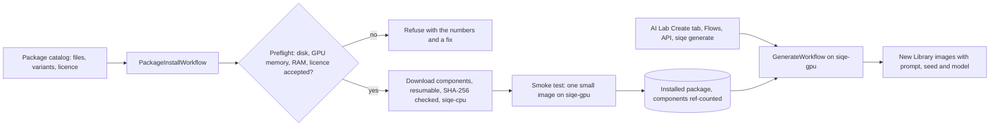

# Phase 7 plan: model packages (text to image and image to image)

Status: **planned**, after P6 Hardening. Decision record: [ADR 0010](../adr/0010-model-packages.md) (proposed).

Phase 7 adds **packages**: installable bundles of several model files plus the pipeline that runs them, installed by a workflow with checks before and after. The first packages bring image generation to SIQE Studio: **text to image** (write a prompt, get an image) and **image to image** (edit a photo, or combine reference images, by describing the change).

## 1. The first packages

You chose to offer both licence families (2 October 2026): commercial-safe packages by default, and Qwen-Image-2.1 as an opt-in package for personal use.

| Package | Models | Does | Licence | Default |
|---|---|---|---|---|
| **Qwen-Image** | Qwen-Image-2512 (text to image), Qwen-Image-Edit-2511 (image to image, multiple references) | Generate and edit, strong text rendering in images | Apache-2.0 (commercial use allowed) | Yes |
| **Qwen-Image-2.1** | Qwen-Image-2.1: one model for both tasks | Generate and edit, up to 10 references, transparent (RGBA) output, native 2K | **Qwen Research License: non-commercial research and evaluation only**; commercial use needs a separate grant from Alibaba | No: opt-in, licence accepted in the app first |

Qwen-Image-2.1 was released on 20 September 2026. Earlier Qwen-Image releases (through 2512 and Edit-2511) are Apache-2.0; 2.1 moved to a research licence. Re-check both licences when implementation starts.

### Components and sizes (to pin at implementation)

Sizes come from public model listings and are approximate; the manifest will pin each file's URL, size and SHA-256 from the repository itself, as every model in `siqe.ai.manifest` does today.

| Package | Component | Parameters | Variants and download size |
|---|---|---|---|
| Qwen-Image | Transformer, 2512 | about 20B | bf16 about 41 GB · FP8 about 20 GB · GGUF Q4 about 12 GB |
| Qwen-Image | Transformer, Edit-2511 | about 20B | same as above |
| Qwen-Image | Text encoder (Qwen2.5-VL 7B), shared by both | about 8B | bf16 about 16.5 GB · FP8 about 9 GB |
| Qwen-Image | VAE, shared | about 0.13B | about 0.25 GB |
| Qwen-Image-2.1 | Transformer (single-stream DiT) | 7B | int8 7.26 GB · bf16 14.23 GB |
| Qwen-Image-2.1 | Text encoder (Qwen3-VL 8B) | 8B | int8 9.35 GB · w4a8 6.31 GB · bf16 17.53 GB |
| Qwen-Image-2.1 | VAE | | bf16 0.68 GB |

Shared components are stored once and reference-counted, so removing one model of a package never deletes a file another still uses.

## 2. Prerequisites

### On your PC (RTX 3090, 24 GB)

| Need | Qwen-Image-2.1 (int8) | Qwen-Image (FP8, both models) | Why |
|---|---|---|---|
| GPU memory | 24 GB is comfortable; 16 GB works | 24 GB with FP8 or GGUF; full bf16 (about 45 GB) does not fit | The planner loads the text encoder, frees it, then loads the transformer, then decodes with a tiled VAE |
| System memory | 32 GB | 64 GB recommended (32 GB with GGUF) | Weights are staged through RAM while loading, and offloaded parts live there |
| Free disk | about 20 GB, plus the same again while downloading | about 50 GB (FP8), about 30 GB (GGUF), plus download space | Downloads resume from partial files on the data volume |
| `worker-gpu` memory limit | Raise `SIQE_GPU_WORKER_MEMORY` to at least 24 GB | 32 GB or more | Today's default (12 GB) is sized for upscalers |
| NVIDIA driver | A driver supporting the CUDA build in the `ai` image | same | Already required for AI Lab |

The RTX 3090 (Ampere) has no FP8 tensor cores: FP8 weights are stored in FP8 and computed in bfloat16, which saves memory but not time. Expect roughly 20 to 60 seconds per 1 MP image at 20 to 30 steps on a 3090; the plan step measures it on the first run, as AI Lab does for upscalers.

### Network

- Weights live on **Hugging Face** (`huggingface.co`, with files served from its CDN hosts) and **ModelScope** (`modelscope.cn`). Your PC needs to reach one of them; the manifest lists both, Hugging Face first.
- In **this cloud environment**, `huggingface.co` is currently blocked, so packages can't be downloaded or tested here. To develop Phase 7 in Claude Code on the web, allow `huggingface.co` (and its file hosts) in the environment's **Network access** settings (cloud environment menu → Edit → Custom → Allowed domains). Steps: <https://code.claude.com/docs/en/cloud-environments#network-access>.
- An optional Hugging Face token (`SIQE_HF_TOKEN`, planned) raises download rate limits; none of these repositories is gated.

### Software (added to the `ai` image in P7)

- `diffusers` at the first release with the Qwen-Image pipelines (`QwenImagePipeline`, `QwenImageEditPlusPipeline`) and, for 2.1, its pipeline class; pinned, never a development build.
- `transformers` with Qwen2.5-VL and Qwen3-VL support, `accelerate` (offloading), `gguf` (GGUF weights).
- **Risk to check first:** the 2.1 int8 files published for ComfyUI may be in a ComfyUI-specific format. P7.1 confirms which published files load in diffusers, and converts once at install time if needed (as SIQE Classic's weights are converted today).

## 3. How it will work

- **Packages are a new kind of catalog entry** (`siqe.ai.packages`): a list of components (each a pinned file with variants), the tasks it provides (`text_to_image`, `image_to_image`), its licence class (`commercial` or `personal`) and its hardware needs. AI Lab's model library shows packages with their size per variant and what this machine can run.
- **Installing is a workflow**, `PackageInstallWorkflow`: preflight (free disk for the files plus partials, the GPU memory the chosen variant needs, the worker's memory limit, licence accepted), parallel resumable downloads on the CPU worker with per-file checksums, then a smoke test on the GPU worker before the package is marked installed. Cancel, retry and resume work like model downloads today. Uninstalling removes only unshared components.
- **Personal-use licences need your acceptance.** Installing Qwen-Image-2.1 shows the licence's key terms and a link to the full text; the install request carries the accepted licence's id and version, stored with the time. Its card, its results and any flow using it carry a **Personal use only** chip (warning colour, icon and label). Results record the model and licence in their derivation, so exported files can be traced.
- **Generating is a workflow**, `GenerateWorkflow`, on the GPU queue (one GPU job at a time, as today). Inputs: prompt, optional negative prompt, size (aspect presets up to 2K), steps, guidance, seed, number of images, and for image to image the source and reference images from the Library and a strength. Progress is reported per denoising step; cancelling stops between steps.
- **Memory degrades instead of failing**, like the tiling ladder: components load one at a time and are released after use; if memory still runs out, offload more to the CPU, then suggest a smaller size or a lighter variant. The settings that worked are remembered per package and GPU.
- **Results are Library images** with the prompt, seed, settings and model attached, so a result can be regenerated, varied (same prompt, new seed) or sent to Studio and Flows.

### Where you'll use it

- **AI Lab → Create:** a prompt box, reference picker from the Library, size and quality presets, and a results grid; gold, since it runs AI.
- **Flows:** an **Edit with a prompt** block (image to image) for batches; text-to-image runs come from the API and the CLI (`siqe generate "a prompt" --count 4 --download ./out`).
- **API:** `GET /api/packages`, `POST /api/packages/{id}/install` (variant, accepted licence), `POST /api/generate`.

## 4. Steps

| Step | Delivers | Done when |
|---|---|---|
| P7.1 Spike | Load each package's published files with pinned `diffusers`/`transformers` on the 3090; measure memory and time per variant; confirm formats (convert if needed) | A 1 MP image from each model in the `ai` image, with the numbers recorded in this file |
| P7.2 Package catalog | `siqe.ai.packages` with components, variants, licence class, hardware needs; licence acceptance table and migration | Unit tests: catalog validation, licence gating, shared-component refcounts |
| P7.3 Install workflow | Preflight, resumable parallel downloads with checksums, conversion, smoke test, uninstall | Integration test with a tiny fake package; interrupted download resumes |
| P7.4 Generation | `GenerateWorkflow`, text to image and image to image, step progress, cancel, memory ladder, results as Library images with metadata | Torch tests with a tiny pipeline; integration test end to end on CPU with a toy package |
| P7.5 AI Lab | Package cards with variants and licence chips, licence dialog, Create tab | e2e: install the toy package, generate, open the result in Studio |
| P7.6 Flows, API and CLI | Edit with a prompt block, `/api/generate`, `siqe generate` | Flow and CLI tests |
| P7.7 Verify and document | Real runs on the 3090 (or a GPU environment), gallery, ADR 0010 accepted, robustness entries, README | Checklist in AGENTS.md's definition of done |

## 5. Planned error codes

| Code | When |
|---|---|
| `package.not_found` | No package with that id |
| `package.license_not_accepted` | Installing a personal-use package without accepting its current licence |
| `package.insufficient_disk` | Not enough free space for the files and their partial downloads |
| `package.insufficient_gpu` | The chosen variant can't fit this GPU even with offloading; a lighter variant is suggested |
| `package.download_failed` / `package.checksum_mismatch` | As for models today, per component |
| `package.smoke_test_failed` | The installed files didn't produce an image; the package stays uninstalled |
| `generate.not_installed` | Generating with a package that isn't installed |
| `generate.bad_size` | A size outside the model's supported range or multiple |
| `generate.out_of_memory` | Out of memory after every fallback; the message suggests a size or variant that fits |

## 6. Open questions for P7.1

- Does the 2.1 pipeline ship in a released `diffusers` by then, or does it need our own pipeline class (as SIQE Classic and RetinaFace have)?
- Is GGUF fast enough on Ampere to be the default for the 20B Apache-2.0 models, or is FP8 storage with bfloat16 compute better on the 3090?
- Should the Library hide personal-use results from Flows that export or publish outside the machine? (Proposed: allow, but keep the chip and the derivation.)
